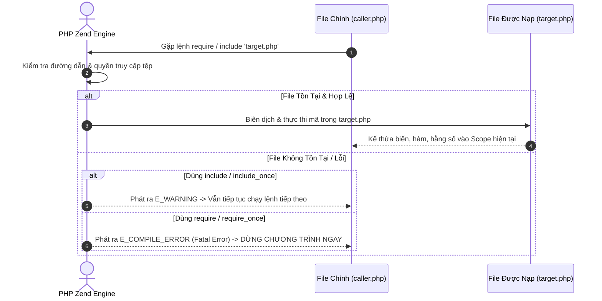
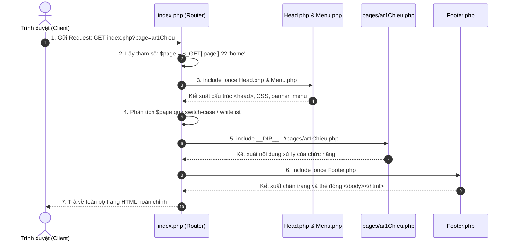

# Kiến Trúc Modular, Quản Lý Layout & Điều Hướng Router Trong PHP

---

## 1. Bản Chất Của Kiến Trúc Modular (Phân Tách Layout)

Trong phát triển ứng dụng Web truyền thống, nếu mỗi trang đều lặp lại toàn bộ mã HTML (`<!DOCTYPE html>`, `<head>`, `<nav>`, `<body>`, `<footer>`):
* **Sự cố lặp mã (Code Duplication):** Khi cần thay đổi 1 đường link trong Menu hoặc sửa tiêu đề trên Header, bạn phải mở và chỉnh sửa hàng chục file.
* **Giải pháp Modular trong PHP:** Phân tách giao diện thành các thành phần (Component/Module) độc lập, chỉ định nghĩa **1 lần duy nhất**:
  * **`Head.php`**: Khai báo thẻ `<head>`, tiêu đề trang, link CSS chung, file JavaScript và banner đầu trang.
  * **`Menu.php`**: Thanh điều hướng danh mục (`<aside class="left-menu">`).
  * **`Footer.php`**: Chân trang (`<footer>`), bản quyền và thông tin liên hệ.

---

## 2. Phân Tích Chuyên Sâu 4 Cấu Trúc Nhúng File: `include`, `include_once`, `require`, `require_once`

Khi PHP gặp chỉ thị nạp file, Zend Engine sẽ đọc file đích, phân tích cú pháp (compile thành opcodes) và nhúng trực tiếp luồng thực thi vào đúng vị trí và phạm vi (Scope) của file đang gọi.



### 2.1. Bảng Ma Trận So Sánh Tính Chất

| Cấu trúc lệnh | Mức độ cảnh báo khi lỗi | Luồng thực thi khi gặp lỗi | Kiểm tra trùng lặp | Ứng dụng chuẩn |
| :--- | :--- | :--- | :--- | :--- |
| **`include`** | `E_WARNING` | **Tiếp tục chạy bình thường** | Không (Nạp bao nhiêu lần chạy bấy nhiêu) | Nạp Banner, Widget, file giao diện phụ. |
| **`include_once`** | `E_WARNING` | **Tiếp tục chạy bình thường** | **Có** (Chỉ nạp 1 lần duy nhất) | Nạp Header, Footer, Menu HTML. |
| **`require`** | `Fatal Error` | **DỪNG TOÀN BỘ CHƯƠNG TRÌNH** | Không | Nạp template bắt buộc, nạp file cấu hình phụ. |
| **`require_once`** | `Fatal Error` | **DỪNG TOÀN BỘ CHƯƠNG TRÌNH** | **Có** (Chỉ nạp 1 lần duy nhất) | **Nạp Thư viện hàm (`libs/`), Kết nối Database, Class/Interface.** |

### 2.2. Cơ Chế Nội Bộ Của Hậu Tố `_once` (Hash Table Lookup)
Khi dùng `require_once` hoặc `include_once`, PHP duy trì một danh sách bảng băm (Hash Table) nội bộ chứa toàn bộ đường dẫn tuyệt đối của các file đã nạp. 
* Trước khi nạp file mới, PHP kiểm tra xem đường dẫn file đã nằm trong danh sách chưa.
* Nếu **đã có** $\rightarrow$ PHP **bỏ qua ngay lập tức**, không tốn chi phí đọc lại file từ ổ cứng.
* **Tác dụng cốt lõi:** Ngăn chặn lỗi kinh điển:
  > `Fatal error: Cannot redeclare function tenHam() (previously declared in ...)`

### 2.3. Phạm Vi Biến (Variable Scope) Khi Nhúng File
* Một file được nhúng sẽ **kế thừa toàn bộ phạm vi biến** tại dòng lệnh mà nó được gọi:
  * Nếu gọi `include` ở phạm vi toàn cục (Global Scope) $\rightarrow$ File được nhúng nhìn thấy toàn bộ biến toàn cục.
  * Nếu gọi `include` bên trong một hàm (Local Function Scope) $\rightarrow$ File được nhúng chỉ nhìn thấy các biến cục bộ bên trong hàm đó.

### 2.4. Magic Constant `__DIR__` vs Đường Dẫn Tương Đối
* **Vấn đề của đường dẫn tương đối (`include 'pages/home.php'`):** PHP sẽ tìm file dựa theo **Current Working Directory (CWD)** của tiến trình web server. Nếu trang con gọi trang cháu, CWD bị thay đổi dẫn đến lỗi `Failed to open stream`.
* **`__DIR__`:** Trả về **đường dẫn thư mục tuyệt đối trên ổ cứng** của file đang chứa dòng code đó (không có dấu gạch chéo ở cuối).
* **Cú pháp chuẩn mực bắt buộc:**
  ```php
  include_once __DIR__ . '/../Bai1/Head.php';
  require_once __DIR__ . '/../libs/xuLyMangSo.php';
  ```

---

## 3. Kiến Trúc Single Entry Point Router

### 3.1. Luồng Hoạt Động Tuần Tự (Sequence Diagram)

Trong kiến trúc Single Entry Point, mọi Request của người dùng đều đi qua 1 cửa ngõ duy nhất là `index.php`. Trang con được yêu cầu sẽ được truyền qua tham số URL Query String `?page=...`:



### 3.2. Cấu Trúc Mã Nguồn Chuẩn Trong `index.php`

```php
<?php
// 1. Khởi tạo session nếu cần quản lý trạng thái
if (session_status() === PHP_SESSION_NONE) {
    session_start();
}

// 2. Lấy tham số page từ URL (sử dụng toán tử Null Coalescing '??' để gán mặc định)
$page = $_GET['page'] ?? 'home';

// 3. Nhúng khung layout chung (Header & Menu bên trái)
include_once __DIR__ . '/../Bai1/Head.php';
include_once __DIR__ . '/../Bai1/Menu.php';
?>

<!-- 4. Cột nội dung chính bên phải -->
<div class="main-content">
    <!-- Menu các Tab chức năng con -->
    <div class="menu-nav">
        <a href="index.php?page=home" class="<?= ($page === 'home') ? 'active' : '' ?>">Home</a>
        <a href="index.php?page=ar1Chieu" class="<?= ($page === 'ar1Chieu') ? 'active' : '' ?>">Mảng 1 Chiều</a>
        <a href="index.php?page=matrix" class="<?= ($page === 'matrix') ? 'active' : '' ?>">Ma Trận</a>
        <a href="index.php?page=associateArr" class="<?= ($page === 'associateArr') ? 'active' : '' ?>">Mảng Kết Hợp</a>
    </div>

    <!-- Khung nạp nội dung trang con -->
    <div class="content">
        <?php
        // 5. Điều hướng an toàn bằng switch-case (Chống lỗ hổng Local File Inclusion - LFI)
        switch ($page) {
            case 'ar1Chieu':
                include __DIR__ . '/pages/ar1Chieu.php';
                break;

            case 'matrix':
                include __DIR__ . '/pages/matrix.php';
                break;

            case 'associateArr':
                include __DIR__ . '/pages/associateArr.php';
                break;

            case 'home':
            default:
                include __DIR__ . '/pages/home.php';
                break;
        }
        ?>
    </div>
</div>

<?php
// 6. Nhúng Chân trang dùng chung
include_once __DIR__ . '/../Bai1/Footer.php';
?>
```

---

## 4. Cảnh Báo An Ninh: Phòng Chống Lỗ Hổng LFI (Local File Inclusion)

* **LỖI NGUY HIỂM:** Rất nhiều người mới học viết:
  ```php
  // CỰC KỲ NGUY HIỂM - DỄ BỊ HACK TOÀN BỘ SERVER
  include "pages/" . $_GET['page'] . ".php";
  ```
  Kẻ tấn công có thể truyền: `?page=../../../../windows/win.ini` hoặc nạp file mã độc vừa upload lên server để chiếm quyền điều khiển.
* **GIẢI PHÁP CHUẨN:**
  1. Sử dụng cấu trúc **`switch-case`** tường minh (như code ở mục 3.2).
  2. Hoặc sử dụng kỹ thuật **Danh sách trắng (Whitelist Array)**:
     ```php
     $allowedPages = ['home', 'ar1Chieu', 'matrix', 'associateArr'];
     if (in_array($page, $allowedPages, true)) {
         include __DIR__ . "/pages/{$page}.php";
     } else {
         include __DIR__ . "/pages/home.php";
     }
     ```
