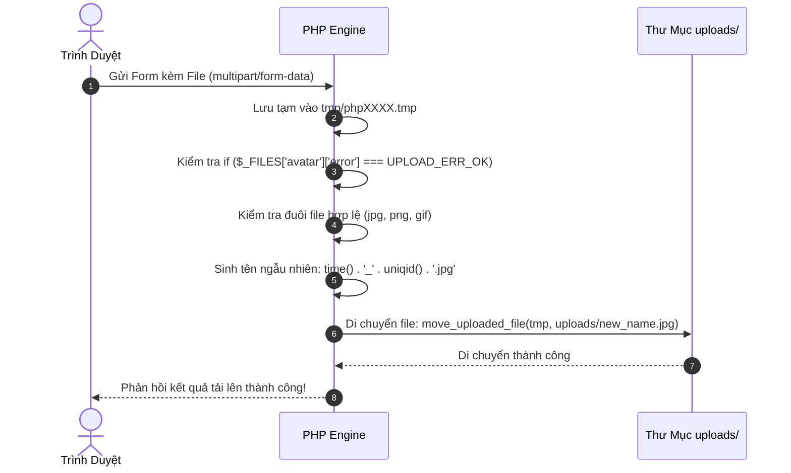

# Truyền Nhận Dữ Liệu & Xử Lý Form (HTML $\rightarrow$ PHP, GET, POST & File Upload)

---

## 1. Cơ Chế Cốt Lõi: PHP Lấy Dữ Liệu Từ HTML Form Như Thế Nào?

Đây là kiến thức nền tảng và quan trọng nhất trong lập trình web với PHP: **Làm sao PHP biết người dùng đã nhập gì trên trang HTML?**

```mermaid
sequenceDiagram
    autonumber
    actor User as Người dùng (User)
    participant Browser as Trình duyệt (Browser)
    participant Server as Web Server (PHP Engine)
    participant Code as Script PHP (Xử lý)

    User->>Browser: Nhập Form (<input name="username" value="admin">) & Bấm Submit
    Browser->>Browser: Đóng gói dữ liệu theo cặp name=value (username=admin)
    Browser->>Server: Gửi HTTP Request (POST / GET) đến Web Server
    Server->>Server: Tự động phân tích gói tin & khởi tạo $_POST / $_GET
    Server->>Code: Chuyển dữ liệu cho file PHP xử lý
    Code->>Code: Lấy dữ liệu: $user = trim($_POST['username'] ?? '')
    Code-->>Server: Kết xuất HTML kết quả xử lý
    Server-->>Browser: Phản hồi trang HTML kết quả
    Browser-->>User: Hiển thị kết quả trên màn hình
```



### 1.1. Thuộc Tính `name` Trong HTML Là "Chiếc Chìa Khóa Vàng" (The Key)

- **Quy tắc bất biến:** PHP **chỉ nhận diện và lấy được dữ liệu** của một thẻ HTML nếu thẻ đó có khai báo thuộc tính **`name="..."`**.
- Tên đặt trong thuộc tính `name` ở HTML sẽ trở thành **Key (Khóa)** trong mảng `$_GET` hoặc `$_POST` của PHP.
- _Lưu ý:_ Thuộc tính `id="..."` hoặc `class="..."` chỉ dùng cho CSS và JavaScript, PHP **hoàn toàn không nhìn thấy** `id` hay `class`.

---

## 2. Chi Tiết Cách PHP Nhận Dữ Liệu Từ Từng Loại Thẻ Form HTML

### 2.1. Thẻ Nhập Văn Bản Đơn Lẻ (`text`, `password`, `hidden`, `textarea`, `number`, `date`)

#### HTML:

```html
<form method="POST" action="process.php">
  <!-- Nhập chữ -->
  <input type="text" name="username" placeholder="Tên đăng nhập" />

  <!-- Mật khẩu -->
  <input type="password" name="password" />

  <!-- Chọn ngày sinh -->
  <input type="date" name="birthday" />

  <!-- Thẻ ẩn chứa cờ đánh dấu -->
  <input type="hidden" name="action" value="register" />

  <!-- Khung nhập nhiều dòng -->
  <textarea name="ghi_chu"></textarea>

  <button type="submit">Gửi</button>
</form>
```

#### PHP Nhận Dữ Liệu (`process.php`):

```php
$user     = trim($_POST['username'] ?? '');
$pass     = trim($_POST['password'] ?? '');
$birthday = trim($_POST['birthday'] ?? '');
$action   = $_POST['action'] ?? '';
$note     = trim($_POST['ghi_chu'] ?? '');
```

---

### 2.2. Nút Chọn Một (Radio Button) $\rightarrow$ Trạng Thái `checked`

- **Đặc điểm:** Các nút Radio trong cùng một câu hỏi phải có **cùng thuộc tính `name`**, nhưng **khác thuộc tính `value`**.
- **Cơ chế Submit của Trình duyệt:** Trình duyệt **chỉ gửi duy nhất** giá trị `value` của nút Radio đang được chọn (có trạng thái `checked`).
- **Kỹ thuật giữ lại lựa chọn cũ (Sticky Radio):** Dùng toán tử 3 ngôi kiểm tra giá trị cũ để in ra chữ `checked`:

#### HTML & PHP:

```php
<?php
// Lấy giá trị đã chọn (nếu chưa có thì mặc định là 'Nam')
$currentGender = $_POST['gioitinh'] ?? 'Nam';
?>

<form method="POST">
    <label>
        <input type="radio" name="gioitinh" value="Nam" <?= ($currentGender === 'Nam') ? 'checked' : '' ?>> Nam
    </label>
    <label>
        <input type="radio" name="gioitinh" value="Nu" <?= ($currentGender === 'Nu') ? 'checked' : '' ?>> Nữ
    </label>
    <label>
        <input type="radio" name="gioitinh" value="Khac" <?= ($currentGender === 'Khac') ? 'checked' : '' ?>> Khác
    </label>
    <button type="submit">Xác nhận</button>
</form>
```

---

### 2.3. Hộp Chọn Nhiều (Checkbox) $\rightarrow$ Kỹ Thuật Mảng `name="ten_bien[]"` & `checked`

- **Đặc điểm sống còn:**
  1. Nếu người dùng **không tick** vào ô Checkbox, trình duyệt **HOÀN TOÀN KHÔNG GỬI** trường đó lên server (tức là `isset($_POST['so_thich'])` sẽ trả về `false`).
  2. Để chọn được nhiều giá trị, thuộc tính `name` **BẮT BUỘC phải có cặp ngoặc vuông `[]`** ở cuối (ví dụ `name="so_thich[]"`).
- **Kỹ thuật giữ lại lựa chọn cũ (Sticky Checkbox):** Dùng hàm `in_array($val, $selectedArray)` để kiểm tra xem giá trị đó có trong mảng cũ không:

#### HTML & PHP:

```php
<?php
// Mảng danh sách các sở thích được người dùng tick chọn
$selectedHobbies = $_POST['so_thich'] ?? [];
?>

<form method="POST">
    <label>
        <input type="checkbox" name="so_thich[]" value="BongDa" <?= in_array('BongDa', $selectedHobbies) ? 'checked' : '' ?>> Đá bóng
    </label>
    <label>
        <input type="checkbox" name="so_thich[]" value="AmNhac" <?= in_array('AmNhac', $selectedHobbies) ? 'checked' : '' ?>> Âm nhạc
    </label>
    <label>
        <input type="checkbox" name="so_thich[]" value="DocSach" <?= in_array('DocSach', $selectedHobbies) ? 'checked' : '' ?>> Đọc sách
    </label>
    <button type="submit">Lưu sở thích</button>
</form>
```

---

### 2.4. Danh Sách Thả Xuống (Dropdown Select) $\rightarrow$ Trạng Thái `selected`

Khác với Radio và Checkbox dùng chữ `checked`, thẻ `<option>` bên trong thẻ `<select>` sử dụng thuộc tính **`selected`** (hoặc `selected="selected"`).

#### A. Chọn Đơn (Single Select Dropdown):

- **Cơ chế gửi dữ liệu:** Trình duyệt sẽ lấy thuộc tính `name` của thẻ `<select>` và gửi kèm `value` của thẻ `<option>` đang có thuộc tính `selected` (hoặc option mà người dùng vừa bấm chọn).
- **Lưu ý:** Nếu thẻ `<option>` không khai báo `value="..."`, trình duyệt sẽ gửi phần văn bản hiển thị bên trong `<option>Text</option>`. Tuy nhiên, chuẩn lập trình là **luôn luôn khai báo thuộc tính `value` rõ ràng**.

```php
<?php
$selectedCity = $_POST['thanh_pho'] ?? 'HN'; // Mặc định là 'HN'
?>

<form method="POST">
    <label for="thanh_pho">Chọn thành phố:</label>
    <select id="thanh_pho" name="thanh_pho">
        <option value="HN" <?= ($selectedCity === 'HN') ? 'selected' : '' ?>>Hà Nội</option>
        <option value="HCM" <?= ($selectedCity === 'HCM') ? 'selected' : '' ?>>TP. Hồ Chí Minh</option>
        <option value="DN" <?= ($selectedCity === 'DN') ? 'selected' : '' ?>>Đà Nẵng</option>
        <option value="HP" <?= ($selectedCity === 'HP') ? 'selected' : '' ?>>Hải Phòng</option>
    </select>
    <button type="submit">Lưu</button>
</form>
```

#### B. Chọn Nhiều (Multiple Select Dropdown):

- Thẻ `<select>` có thêm thuộc tính `multiple` và thuộc tính `name="skills[]"` có cặp ngoặc vuông `[]`.
- **Kỹ thuật Sticky:** Tương tự checkbox, dùng `in_array($val, $selectedSkills)` để in ra `selected`:

```php
<?php
$selectedSkills = $_POST['skills'] ?? ['PHP']; // Mặc định chọn 'PHP'
?>

<form method="POST">
    <label for="skills">Chọn các kỹ năng (giữ Ctrl để chọn nhiều):</label>
    <select id="skills" name="skills[]" multiple size="4">
        <option value="PHP" <?= in_array('PHP', $selectedSkills) ? 'selected' : '' ?>>PHP</option>
        <option value="JS" <?= in_array('JS', $selectedSkills) ? 'selected' : '' ?>>JavaScript</option>
        <option value="Python" <?= in_array('Python', $selectedSkills) ? 'selected' : '' ?>>Python</option>
        <option value="Java" <?= in_array('Java', $selectedSkills) ? 'selected' : '' ?>>Java</option>
    </select>
    <button type="submit">Lưu kỹ năng</button>
</form>

<?php
// Xử lý PHP khi nhận mảng:
if (!empty($_POST['skills'])) {
    echo "Các kỹ năng đã chọn: " . implode(', ', $_POST['skills']);
}
?>
```

#### C. Kỹ Thuật Sinh Dropdown Select Tự Động Bằng Vòng Lặp `foreach`

Trong thực tế dự án, ta không gõ tay từng thẻ `<option>` mà lưu dữ liệu trong mảng cấu hình và duyệt vòng lặp để sinh HTML cực kỳ sạch sẽ:

```php
<?php
// Mảng danh mục các lớp học
$classes = [
    'class1' => 'Lớp Công Nghệ Thông Tin 1',
    'class2' => 'Lớp Khoa Học Máy Tính 2',
    'class3' => 'Lớp An Toàn Thông Tin 3'
];

$selectedClass = $student['class'] ?? 'class1';
?>

<select name="class" class="form-control">
    <?php foreach ($classes as $code => $title): ?>
        <option value="<?= $code ?>" <?= ($selectedClass === $code) ? 'selected' : '' ?>>
            <?= htmlspecialchars($title) ?>
        </option>
    <?php endforeach; ?>
</select>
```

---

### 2.5. Ma Trận & Mảng 2 Chiều Trong Form HTML

Khi cần nhập dữ liệu dạng bảng lưới (như Ma trận $3 \times 3$), ta khai báo chỉ số mảng 2 chiều trực tiếp trong `name`:

#### HTML:

```html
<input type="number" name="matrix[0][0]" value="1" />
<input type="number" name="matrix[0][1]" value="2" />
<input type="number" name="matrix[1][0]" value="3" />
<input type="number" name="matrix[1][1]" value="4" />
```

#### PHP Nhận Dữ Liệu:

PHP tự động cấu trúc thành mảng 2 chiều hoàn chỉnh:

```php
$matrix = $_POST['matrix'] ?? [];
echo $matrix[0][0]; // 1
echo $matrix[0][1]; // 2
echo $matrix[1][0]; // 3
echo $matrix[1][1]; // 4
```

---

## 3. Bản Chất Các Phương Thức Truyền Dữ Liệu: GET vs POST

| Tiêu chí                          | Phương thức GET (`$_GET`)                                                                                           | Phương thức POST (`$_POST`)                                                                      |
| :-------------------------------- | :------------------------------------------------------------------------------------------------------------------ | :----------------------------------------------------------------------------------------------- |
| **Vị trí mang dữ liệu**           | Gắn trực tiếp lên thanh URL sau dấu hỏi chấm (`?key1=val1&key2=val2`).                                              | Đóng gói ngầm trong phần thân (**HTTP Request Body**).                                           |
| **Tính riêng tư / Bảo mật**       | **Thấp**: Dữ liệu hiển thị rõ trên URL, bị lưu vào lịch sử duyệt web (History) và Server Logs.                      | **Cao hơn**: Không lộ dữ liệu trên URL.                                                          |
| **Giới hạn dung lượng**           | Bị giới hạn bởi độ dài tối đa của URL (khoảng 2.048 ký tự tùy trình duyệt).                                         | Không giới hạn về mặt lý thuyết (giới hạn thực tế cấu hình trong `php.ini` qua `post_max_size`). |
| **Gửi dữ liệu nhị phân (Binary)** | **KHÔNG THỂ**: Không gửi được file ảnh, file nén, tài liệu...                                                       | **BẮT BUỘC DÙNG POST** để upload file.                                                           |
| **Khả năng Bookmark & Cache**     | Có thể lưu Bookmark, Cache kết quả và chia sẻ link trực tiếp.                                                       | Không thể Bookmark kết quả submit; khi F5 sẽ hiện cảnh báo gửi lại form.                         |
| **Trường hợp áp dụng chuẩn**      | Tìm kiếm, lọc dữ liệu, phân trang danh sách, chuyển tab menu, truyền ID xem chi tiết/sửa/xóa (`?page=detail&id=1`). | Đăng ký, Đăng nhập, Thanh toán, Thêm/Sửa dữ liệu Form lớn, Upload file.                          |

---

## 4. Truyền Tham Số Hành Động Qua URL (Action Links & Data Flow)

Trong ứng dụng quản lý (CRUD), ta thường dùng các thẻ liên kết `<a>` kèm phương thức GET để điều hướng người dùng tới các tác vụ con:

```html
<!-- Xem chi tiết sinh viên index 0 -->
<a href="index.php?page=detail&id=0">Detail</a>

<!-- Mở form chỉnh sửa sinh viên index 0 -->
<a href="index.php?page=edit&id=0">Edit</a>

<!-- Xóa sinh viên index 0 kèm hộp thoại xác nhận JavaScript -->
<a
  href="index.php?page=delete&id=0"
  onclick="return confirm('Bạn có chắc muốn xóa bản ghi này?');"
  >Delete</a
>
```

### Tiếp Nhận Và Ép Kiểu An Toàn Trong PHP:

```php
// Luôn ép kiểu intval() để ngăn chặn mã độc SQL Injection hoặc Path Traversal
$id = isset($_GET['id']) ? intval($_GET['id']) : -1;

if ($id >= 0) {
    // Thực hiện thao tác tương ứng
}
```

---

## 5. Các Hàm Chuẩn Hóa & Bảo Mật Dữ Liệu Form

### 5.1. Hàm `trim()` - Cắt Khoảng Trắng Thừa

```php
$username = trim($_POST['username'] ?? ''); // "  admin  " -> "admin"
```

### 5.2. Hàm `htmlspecialchars()` - Phòng Chống XSS (Cross-Site Scripting)

Chuyển các ký tự nguy hiểm của HTML (`<`, `>`, `&`, `"`, `'`) thành các thực thể an toàn (HTML Entities):

```php
echo htmlspecialchars($rawUserInput, ENT_QUOTES, 'UTF-8');
```

### 5.3. Kỹ Thuật Sticky Form (Giữ Lại Dữ Liệu Đã Nhập)

Nhúng giá trị cũ đã được lọc an toàn vào thuộc tính `value` của thẻ `<input>` để khi người dùng nhập sai 1 trường, các trường khác không bị mất dữ liệu:

```html
<input
  type="text"
  name="fullname"
  value="<?= htmlspecialchars($fullName ?? '') ?>"
  required
/>
```

---

## 6. Cơ Chế Xử Lý Upload File Chuyên Sâu Trong PHP (`$_FILES`)

### 6.1. Hai Điều Kiện Bắt Buộc Của Form Upload

1. Thuộc tính **`method="POST"`**.
2. Thuộc tính **`enctype="multipart/form-data"`**.

```html
<form method="POST" action="uploadProcess.php" enctype="multipart/form-data">
  <input type="file" name="avatar" accept="image/*" required />
  <button type="submit">Tải Lên</button>
</form>
```

---

### 6.2. Cấu Trúc Chi Tiết Mảng `$_FILES['avatar']`

Khi người dùng upload 1 file, PHP tạo ra một mảng kết hợp với 5 phần tử:

| Khóa (Key)     | Kiểu Dữ Liệu | Ý Nghĩa Chi Tiết                                                                                                                                                                                      |
| :------------- | :----------- | :---------------------------------------------------------------------------------------------------------------------------------------------------------------------------------------------------- |
| **`name`**     | `string`     | Tên gốc của file trên máy tính người dùng (ví dụ: `my_avatar.jpg`).                                                                                                                                   |
| **`type`**     | `string`     | Định dạng MIME do trình duyệt gửi lên (ví dụ: `image/jpeg`, `image/png`).                                                                                                                             |
| **`tmp_name`** | `string`     | Đường dẫn file tạm được máy chủ PHP lưu trữ trong thư mục tạm của hệ điều hành (ví dụ: `C:\xampp\tmp\phpA1B2.tmp`). File này sẽ **tự động bị xóa** ngay khi script kết thúc nếu không được di chuyển. |
| **`error`**    | `int`        | Mã số phản ánh trạng thái upload (xem bảng mã lỗi bên dưới).                                                                                                                                          |
| **`size`**     | `int`        | Kích thước file tính bằng **Byte**.                                                                                                                                                                   |

---

### 6.3. Bảng Tra Cứu Toàn Bộ Mã Lỗi Trong `$_FILES['key']['error']`

| Mã Lỗi  | Tên Hằng Số PHP             | Ý Nghĩa & Nguyên Nhân                                                                      |
| :-----: | :-------------------------- | :----------------------------------------------------------------------------------------- |
| **`0`** | **`UPLOAD_ERR_OK`**         | **Upload thành công hoàn toàn**, không có lỗi nào.                                         |
| **`1`** | **`UPLOAD_ERR_INI_SIZE`**   | File vượt quá dung lượng tối đa cho phép cấu hình trong `php.ini` (`upload_max_filesize`). |
| **`2`** | **`UPLOAD_ERR_FORM_SIZE`**  | File vượt quá dung lượng quy định trong thẻ ẩn `MAX_FILE_SIZE` của HTML form.              |
| **`3`** | **`UPLOAD_ERR_PARTIAL`**    | File chỉ mới được tải lên **một phần** (do đứt kết nối mạng giữa chừng).                   |
| **`4`** | **`UPLOAD_ERR_NO_FILE`**    | Người dùng **không chọn file** nào nhưng vẫn bấm Submit.                                   |
| **`6`** | **`UPLOAD_ERR_NO_TMP_DIR`** | Máy chủ thiếu thư mục tạm (`upload_tmp_dir` trong `php.ini`).                              |
| **`7`** | **`UPLOAD_ERR_CANT_WRITE`** | Không thể ghi file vào ổ cứng máy chủ (lỗi phân quyền thư mục Disk Permissions).           |
| **`8`** | **`UPLOAD_ERR_EXTENSION`**  | Một PHP Extension đã chặn quá trình tải file.                                              |

---

### 6.4. Quy Trình Upload & Đổi Tên File An Toàn Tuyệt Đối



#### Code Mẫu Chuẩn Cho Tác Vụ Thêm & Sửa Ảnh:

```php
function uploadAvatar(array $fileInput, string $targetDir = '../uploads/'): ?string
{
    // 1. Kiểm tra trạng thái upload
    if (!isset($fileInput['error']) || $fileInput['error'] !== UPLOAD_ERR_OK) {
        return null;
    }

    // 2. Kiểm tra phần mở rộng (Extension) an toàn
    $fileName = basename($fileInput['name']);
    $fileExt  = strtolower(pathinfo($fileName, PATHINFO_EXTENSION));
    $allowedExts = ['jpg', 'jpeg', 'png', 'gif'];

    if (!in_array($fileExt, $allowedExts, true)) {
        return null; // Đuôi file không hợp lệ
    }

    // 3. Đảm bảo thư mục lưu trữ tồn tại
    if (!is_dir($targetDir)) {
        mkdir($targetDir, 0777, true);
    }

    // 4. Đổi tên file ngẫu nhiên chống trùng lặp và chống ghi đè
    $newFileName = time() . '_' . uniqid() . '.' . $fileExt;
    $targetPath  = rtrim($targetDir, '/') . '/' . $newFileName;

    // 5. Di chuyển file từ thư mục tạm sang thư mục đích
    if (move_uploaded_file($fileInput['tmp_name'], $targetPath)) {
        return $newFileName;
    }

    return null;
}
```

---

## 7. Mẫu Thiết Kế PRG (Post/Redirect/Get Pattern)

Khi người dùng gửi dữ liệu qua `POST` (như Thêm, Sửa hoặc Xóa), nếu trang kết thúc mà không chuyển hướng, người dùng nhấn **F5 (Refresh)** sẽ khiến trình duyệt gửi lại Form lần thứ hai, gây trùng lặp dữ liệu.

👉 **Giải pháp PRG:** Sau khi xử lý POST thành công, gọi lệnh chuyển hướng `header()` và kết thúc bằng `exit;`:

```php
if ($_SERVER['REQUEST_METHOD'] === 'POST') {
    // 1. Xử lý thêm sinh viên vào file
    addStudent($newStudent);

    // 2. Chuyển hướng sang trang danh sách (GET Request)
    header('Location: index.php?page=list');
    exit;
}
```
