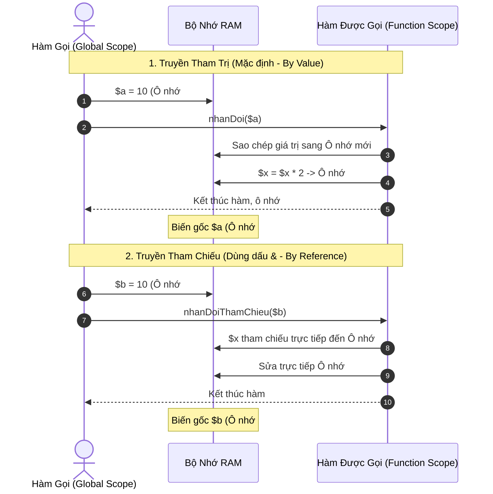
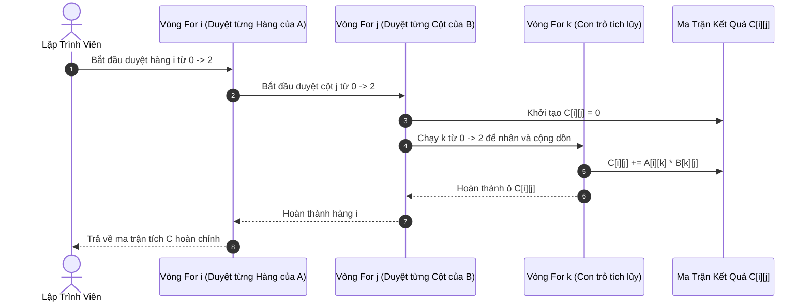
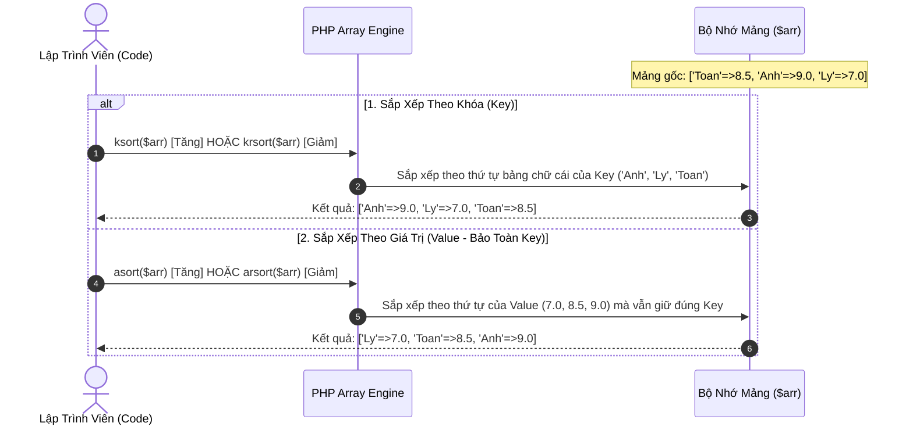

# Thư Viện Hàm & Cấu Trúc Dữ Liệu Mảng Trong PHP

---

## 1. Định Nghĩa Hàm (Function) & Tổ Chức Thư Viện Trong PHP

### 1.1. Cú Pháp Định Nghĩa Hàm Chuẩn Hiện Đại

Từ PHP 7.0 trở lên, lập trình PHP khuyến nghị áp dụng chuẩn **Khai báo kiểu dữ liệu tham số (Type Hinting)** và **Kiểu dữ liệu trả về (Return Type)**. Việc này giúp code rõ ràng, tự kiểm tra tính đúng đắn và bắt lỗi ngay khi biên dịch:

```php
declare(strict_types=1); // Bật chế độ kiểm tra kiểu dữ liệu nghiêm ngặt

/**
 * Tính điểm trung bình của một mảng số thực kèm hệ số
 *
 * @param array<float|int> $danhSachDiem Mảng chứa danh sách điểm
 * @param int $heSo Hệ số nhân (mặc định = 1)
 * @return float Điểm trung bình đã nhân hệ số
 */
function tinhDiemTrungBinh(array $danhSachDiem, int $heSo = 1): float
{
    if (empty($danhSachDiem)) {
        return 0.0;
    }
    $tong = array_sum($danhSachDiem);
    $soLuong = count($danhSachDiem);
    return ($tong / $soLuong) * $heSo;
}
```

#### Các Kiểu Dữ Liệu Được Hỗ Trợ (Type Hints):

- **Nguyên thủy (Scalar Types):** `int`, `float`, `string`, `bool`.
- **Cấu trúc dữ liệu:** `array`, `object`, `callable`, `iterable`.
- **Kiểu đặc biệt:**
  - `void`: Hàm thực thi công việc và **không trả về giá trị** nào (không có `return` hoặc chỉ `return;`).
  - `never` (PHP 8.1+): Hàm kết thúc bằng `exit()`, `die()` hoặc quăng `Exception` mà không bao giờ quay lại luồng gọi.
  - `mixed` (PHP 8.0+): Chấp nhận bất kỳ kiểu dữ liệu nào.
  - Kiểu có thể nhận `null` (Nullable Types): Đặt dấu `?` trước kiểu, ví dụ `?string` nghĩa là có thể là `string` hoặc `null`.

---

### 1.2. Cơ Chế Truyền Tham Số: Tham Trị (By Value) vs Tham Chiếu (By Reference)



#### Phân Tích Code:

```php
// 1. Truyền tham trị (Pass-by-value): An toàn, không gây tác dụng phụ (Side-effects)
function tangGiaTri(int $num): int {
    $num += 5;
    return $num;
}
$x = 10;
tangGiaTri($x);
// $x vẫn là 10

// 2. Truyền tham chiếu (Pass-by-reference): Dùng ký tự & trước tên tham số
function tangGiaTriGoc(int &$num): void {
    $num += 5;
}
$y = 10;
tangGiaTriGoc($y);
// $y lúc này trở thành 15
```

---

### 1.3. Tham Số Biến Thiên (Variadic Parameters) & Default Arguments

```php
// Tham số biến thiên sử dụng toán tử ba chấm (...) để gom tất cả đối số thành 1 mảng
function tinhTongTatCa(int ...$numbers): int {
    return array_sum($numbers);
}

echo tinhTongTatCa(1, 2, 3);          // Kết quả: 6
echo tinhTongTatCa(10, 20, 30, 40);   // Kết quả: 100
```

---

### 1.4. Nguyên Tắc Tổ Chức Thư Viện Hàm (`libs/`)

1. **Nguyên tắc phân tách trách nhiệm (Separation of Concerns):**
   - File trong thư viện (`libs/xuLyMangSo.php`, `libs/xuLyMatran.php`) **chỉ chứa định nghĩa hàm tính toán/xử lý logic**, tuyệt đối không chứa mã HTML, lệnh `echo` hay nhận trực tiếp `$_POST`.
   - File trang (`pages/ar1Chieu.php`) nhận `$_POST`, gọi các hàm trong `libs/` để xử lý, sau đó in kết quả ra HTML.
2. **Nạp thư viện an toàn:** Luôn dùng `require_once __DIR__ . '/../libs/tenFile.php'` để tránh nạp trùng lặp gây lỗi `Cannot redeclare function`.

---

## 2. Mảng 1 Chiều (Indexed Array) & Toàn Bộ Nhóm Hàm Xử Lý

Mảng 1 chiều là tập hợp các phần tử được đánh số thứ tự (Index) tự động bắt đầu từ `0, 1, 2, ...`

```php
$numbers = [10, 25, 3, 89, 42];
```

---

### 2.1. Bảng Tra Cứu Các Hàm Thống Kê & Toán Học

| Tên Hàm               | Cú Pháp                                 | Mô Tả & Giá Trị Trả Về                             | Ví Dụ                                         |
| :-------------------- | :-------------------------------------- | :------------------------------------------------- | :-------------------------------------------- |
| **`count()`**         | `count(array $arr): int`                | Đếm tổng số lượng phần tử có trong mảng.           | `count([1, 2, 3])` $\rightarrow$ `3`          |
| **`min()`**           | `min(array $arr): mixed`                | Trả về phần tử có giá trị **nhỏ nhất** trong mảng. | `min([10, 5, 20])` $\rightarrow$ `5`          |
| **`max()`**           | `max(array $arr): mixed`                | Trả về phần tử có giá trị **lớn nhất** trong mảng. | `max([10, 5, 20])` $\rightarrow$ `20`         |
| **`array_sum()`**     | `array_sum(array $arr): float\|int`     | Tính tổng toàn bộ các phần tử số trong mảng.       | `array_sum([1, 2, 3])` $\rightarrow$ `6`      |
| **`array_product()`** | `array_product(array $arr): float\|int` | Tính tích của tất cả các phần tử trong mảng.       | `array_product([2, 3, 4])` $\rightarrow$ `24` |

---

### 2.2. Nhóm Hàm Biến Đổi & Xử Lý Chuỗi $\leftrightarrow$ Mảng

#### A. Hàm `explode(string $separator, string $string, int $limit = PHP_INT_MAX): array`

- **Mục đích:** Cắt một chuỗi văn bản thành mảng các chuỗi con dựa trên ký tự phân tách `$separator`.
- **Ví dụ:**
  ```php
  $input = "12, 45, 78, 23";
  $arr = explode(',', $input); // ['12', ' 45', ' 78', ' 23']
  ```

#### B. Hàm `implode(string $glue, array $pieces): string` (hoặc bí danh `join()`)

- **Mục đích:** Nối các phần tử của một mảng thành một chuỗi duy nhất, ngăn cách bởi ký tự `$glue`.
- **Ví dụ:**
  ```php
  $arr = [1, 2, 3, 4];
  $str = implode(' - ', $arr); // "1 - 2 - 3 - 4"
  ```

#### C. Hàm `array_map(callable|null $callback, array $array, array ...$arrays): array`

- **Mục đích:** Áp dụng một hàm xử lý (callback) lên **từng phần tử** của mảng và trả về mảng kết quả mới.
- **Kỹ thuật chuẩn hóa mảng chuỗi số từ người dùng nhập:**
  ```php
  $rawInput = " 15 ,  30 ,  8 ,  99 ";
  // 1. Tách chuỗi theo dấu phẩy -> explode
  // 2. Cắt khoảng trắng dư thừa từng phần tử -> array_map('trim', ...)
  // 3. Ép kiểu từng phần tử thành số thực -> array_map('floatval', ...)
  $cleanArray = array_map('floatval', array_map('trim', explode(',', $rawInput)));
  // Kết quả: [15.0, 30.0, 8.0, 99.0]
  ```

#### D. Hàm `array_filter(array $array, ?callable $callback = null, int $mode = 0): array`

- **Mục đích:** Lọc các phần tử của mảng dựa trên điều kiện của hàm callback. Nếu callback trả về `true`, phần tử được giữ lại; nếu `false`, phần tử bị loại bỏ.
- **Ví dụ lọc số chẵn:**
  ```php
  $numbers = [1, 2, 3, 4, 5, 6];
  $evenNumbers = array_filter($numbers, function($n) {
      return $n % 2 === 0;
  });
  // Kết quả: [1 => 2, 3 => 4, 5 => 6]
  ```

---

### 2.3. Nhóm Hàm Thêm, Xóa, Ghép & Đảo Mảng 1 Chiều

| Hàm                   | Cú Pháp                                        | Cơ Chế Hoạt Động                                                            |
| :-------------------- | :--------------------------------------------- | :-------------------------------------------------------------------------- |
| **`array_push()`**    | `array_push(array &$arr, mixed ...$values)`    | Thêm một hoặc nhiều phần tử vào **cuối mảng** (hoặc dùng `$arr[] = $val;`). |
| **`array_pop()`**     | `array_pop(array &$arr): mixed`                | Lấy ra và xóa phần tử ở **cuối mảng**.                                      |
| **`array_unshift()`** | `array_unshift(array &$arr, mixed ...$values)` | Thêm một hoặc nhiều phần tử vào **đầu mảng**.                               |
| **`array_shift()`**   | `array_shift(array &$arr): mixed`              | Lấy ra và xóa phần tử ở **đầu mảng**.                                       |
| **`array_merge()`**   | `array_merge(array ...$arrays): array`         | Gộp 2 hay nhiều mảng lại thành một mảng duy nhất.                           |
| **`array_unique()`**  | `array_unique(array $arr): array`              | Loại bỏ tất cả các giá trị trùng lặp trong mảng.                            |
| **`array_reverse()`** | `array_reverse(array $arr): array`             | Đảo ngược thứ tự các phần tử của mảng.                                      |

---

### 2.4. Nhóm Hàm Sắp Xếp Mảng 1 Chiều

| Hàm                        | Hướng Sắp Xếp                                               | Đánh Lại Chỉ Số (Re-index)?              |
| :------------------------- | :---------------------------------------------------------- | :--------------------------------------- |
| **`sort(array &$arr)`**    | Sắp xếp **Tăng dần** (A $\rightarrow$ Z, 0 $\rightarrow$ 9) | **Có** (đánh lại key thành `0, 1, 2...`) |
| **`rsort(array &$arr)`**   | Sắp xếp **Giảm dần** (Z $\rightarrow$ A, 9 $\rightarrow$ 0) | **Có** (đánh lại key thành `0, 1, 2...`) |
| **`shuffle(array &$arr)`** | Xáo trộn ngẫu nhiên các phần tử                             | **Có**                                   |

---

## 3. Mảng 2 Chiều & Đại Số Ma Trận (2D Matrix)

### 3.1. Bản Chất Mảng 2 Chiều Trong Bộ Nhớ

Mảng 2 chiều là một mảng mà mỗi phần tử con của nó lại là một mảng 1 chiều (tương ứng với 1 Hàng trong bảng lưới):

$$\text{Ma trận } A = \begin{bmatrix} a_{00} & a_{01} & a_{02} \\ a_{10} & a_{11} & a_{12} \\ a_{20} & a_{21} & a_{22} \end{bmatrix}$$

```php
$matrix = [
    [1, 2, 3], // Hàng 0 ($matrix[0])
    [4, 5, 6], // Hàng 1 ($matrix[1])
    [7, 8, 9]  // Hàng 2 ($matrix[2])
];

// Truy xuất phần tử: $matrix[row_index][col_index]
echo $matrix[1][2]; // Hàng 1, Cột 2 -> Giá trị: 6
```

---

### 3.2. Thuật Toán Tìm Max / Min Ma Trận Tối Ưu

Thay vì dùng 2 vòng lặp `for` lồng nhau, ta kết hợp hàm `array_map` với `max`/`min`:

```php
function maxMatran(array $matran): float
{
    if (empty($matran)) return 0.0;
    // Bước 1: array_map('max', $matran) tìm Max của từng hàng -> ra mảng 1 chiều [3, 6, 9]
    // Bước 2: max([3, 6, 9]) lấy giá trị lớn nhất trong các giá trị Max đó -> ra 9
    return floatval(max(array_map('max', $matran)));
}

function minMatran(array $matran): float
{
    if (empty($matran)) return 0.0;
    return floatval(min(array_map('min', $matran)));
}
```

---

### 3.3. Thuật Toán Đường Chéo (Ma Trận Vuông $n \times n$)

#### A. Đường Chéo Chính (Main Diagonal):

- Chạy từ góc **Trên-Trái** xuống **Dưới-Phải**.
- Đặc điểm: Chỉ số **Hàng bằng chỉ số Cột ($i = j$)**: $(0,0), (1,1), (2,2), \dots$

```php
function tongCheoChinh(array $matrix): float
{
    $sum = 0.0;
    $n = count($matrix); // Số hàng = Số cột
    for ($i = 0; $i < $n; $i++) {
        $sum += floatval($matrix[$i][$i] ?? 0);
    }
    return $sum;
}
```

#### B. Đường Chéo Phụ (Anti-Diagonal):

- Chạy từ góc **Trên-Phải** xuống **Dưới-Trái**.
- Đặc điểm: Tổng chỉ số hàng và cột luôn bằng **$n - 1$** ($i + j = n - 1 \implies j = n - 1 - i$): $(0, 2), (1, 1), (2, 0)$.

```php
function tongCheoPhu(array $matrix): float
{
    $sum = 0.0;
    $n = count($matrix);
    for ($i = 0; $i < $n; $i++) {
        $sum += floatval($matrix[$i][$n - 1 - $i] ?? 0);
    }
    return $sum;
}
```

---

### 3.4. Thuật Toán Ma Trận Chuyển Vị (Transpose Matrix)

Ma trận chuyển vị $A^T$ nhận được bằng cách hoán đổi các dòng thành các cột ($A^T[j][i] = A[i][j]$):

```php
function chuyenViMatran(array $matrix): array
{
    $transpose = [];
    $rows = count($matrix);
    $cols = count($matrix[0] ?? []);

    for ($i = 0; $i < $rows; $i++) {
        for ($j = 0; $j < $cols; $j++) {
            $transpose[$j][$i] = $matrix[$i][$j];
        }
    }
    return $transpose;
}
```

---

### 3.5. Phép Nhân 2 Ma Trận ($A \times B$): Quy Tắc "Hàng nhân Cột"

Để nhân ma trận $A$ kích thước $m \times k$ với ma trận $B$ kích thước $k \times n$, phần tử kết quả $C[i][j]$ được tính theo công thức:

$$C[i][j] = \sum_{k=0}^{n-1} A[i][k] \times B[k][j]$$



#### Code Cài Đặt:

```php
function nhanHaiMatran(array $m1, array $m2): array
{
    $result = [];
    for ($i = 0; $i < 3; $i++) {          // Duyệt từng Hàng của m1
        for ($j = 0; $j < 3; $j++) {      // Duyệt từng Cột của m2
            $result[$i][$j] = 0;
            for ($k = 0; $k < 3; $k++) { // Con trỏ nhân và cộng dồn
                $result[$i][$j] += floatval($m1[$i][$k] ?? 0) * floatval($m2[$k][$j] ?? 0);
            }
        }
    }
    return $result;
}
```

---

## 4. Mảng Kết Hợp (Associative Array)

Khác với mảng chỉ số, mảng kết hợp sử dụng **chuỗi ký tự (String Key)** làm khóa định danh cho từng giá trị.

```php
$studentScores = [
    'Toan'   => 8.5,
    'VatLy'  => 7.0,
    'HoaHoc' => 9.0,
    'TinHoc' => 9.5
];
```

---

### 4.1. Nhóm Hàm Kiểm Tra & Tìm Kiếm

#### A. Hàm `array_key_exists(string|int $key, array $array): bool`

- **Chức năng:** Kiểm tra xem một **Key** có tồn tại trong mảng hay không.
- **So sánh với `isset($array[$key])`:**
  - Nếu phần tử có tồn tại nhưng giá trị là `null` (`['Toan' => null]`):
    - `isset($arr['Toan'])` $\rightarrow$ trả về **`false`**.
    - `array_key_exists('Toan', $arr)` $\rightarrow$ trả về **`true`** (vì Key thực sự tồn tại).

#### B. Hàm `array_search(mixed $needle, array $haystack): string|int|false`

- **Chức năng:** Tìm kiếm một **Giá trị (Value)** trong mảng và **trả về Khóa (Key)** tương ứng đầu tiên tìm thấy. Nếu không tìm thấy trả về `false`.
- **Ví dụ:**
  ```php
  $monDiemCaoNhat = array_search(9.5, $studentScores); // Trả về chuỗi "TinHoc"
  ```

#### C. Hàm `in_array(mixed $needle, array $haystack, bool $strict = false): bool`

- **Chức năng:** Chỉ kiểm tra xem Giá trị (Value) có tồn tại trong mảng hay không $\rightarrow$ trả về `true`/`false`.
- **Khuyến nghị:** Luôn truyền tham số thứ 3 `$strict = true` để so sánh cả kiểu dữ liệu (`===`).

---

### 4.2. Bốn Hàm Sắp Xếp Cốt Lõi Trên Mảng Kết Hợp

Khi làm việc với mảng kết hợp, tuyệt đối **không dùng `sort()`** vì `sort()` sẽ xóa sạch toàn bộ Key dạng chữ và đánh lại thành số `0, 1, 2...`. Ta sử dụng 4 hàm chuẩn sau:



| Tên Hàm        | Tiêu Chí Sắp Xếp                 | Thứ Tự                                                     | Giải Thích Tên Viết Tắt              |
| :------------- | :------------------------------- | :--------------------------------------------------------- | :----------------------------------- |
| **`ksort()`**  | Sắp xếp theo **Khóa (Key)**      | Tăng dần (A $\rightarrow$ Z, 0 $\rightarrow$ 9)            | **K**ey **Sort**                     |
| **`krsort()`** | Sắp xếp theo **Khóa (Key)**      | Giảm dần (Z $\rightarrow$ A, 9 $\rightarrow$ 0)            | **K**ey **R**everse **Sort**         |
| **`asort()`**  | Sắp xếp theo **Giá trị (Value)** | Tăng dần (Giữ nguyên liên kết Key $\leftrightarrow$ Value) | **A**ssociative **Sort**             |
| **`arsort()`** | Sắp xếp theo **Giá trị (Value)** | Giảm dần (Giữ nguyên liên kết Key $\leftrightarrow$ Value) | **A**ssociative **R**everse **Sort** |

---

### 4.3. Nhóm Hàm Tiện Ích Trên Mảng Kết Hợp

```php
// 1. Lấy toàn bộ danh sách Keys thành mảng 1 chiều
$keys = array_keys($studentScores); // ['Toan', 'VatLy', 'HoaHoc', 'TinHoc']

// 2. Lấy toàn bộ danh sách Values thành mảng 1 chiều
$values = array_values($studentScores); // [8.5, 7.0, 9.0, 9.5]

// 3. Xóa một phần tử theo Key
unset($studentScores['VatLy']);

// 4. Trích xuất 1 cột từ mảng đa chiều danh sách đối tượng
$danhSachSV = [
    ['id' => 1, 'ten' => 'An', 'lop' => 'CNTT1'],
    ['id' => 2, 'ten' => 'Binh', 'lop' => 'CNTT2'],
    ['id' => 3, 'ten' => 'Chi', 'lop' => 'CNTT1']
];
$tenSinhVien = array_column($danhSachSV, 'ten'); // ['An', 'Binh', 'Chi']
$svTheoId = array_column($danhSachSV, 'ten', 'id'); // [1 => 'An', 2 => 'Binh', 3 => 'Chi']
```
