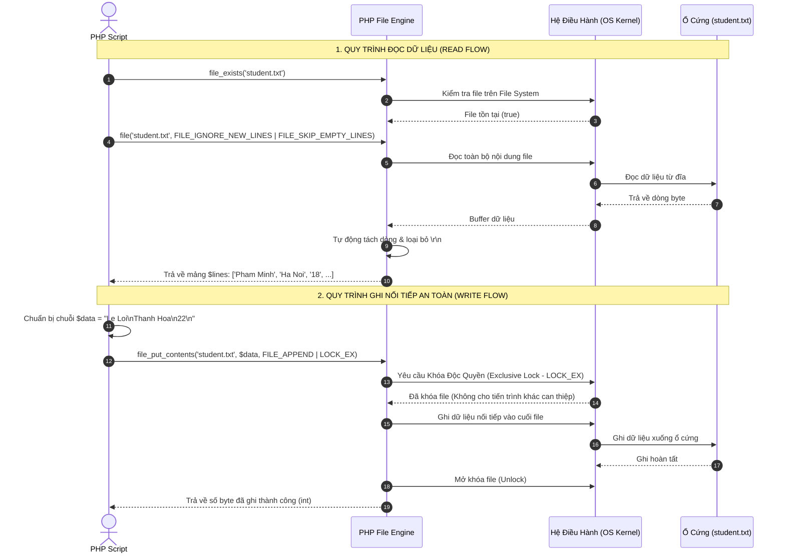
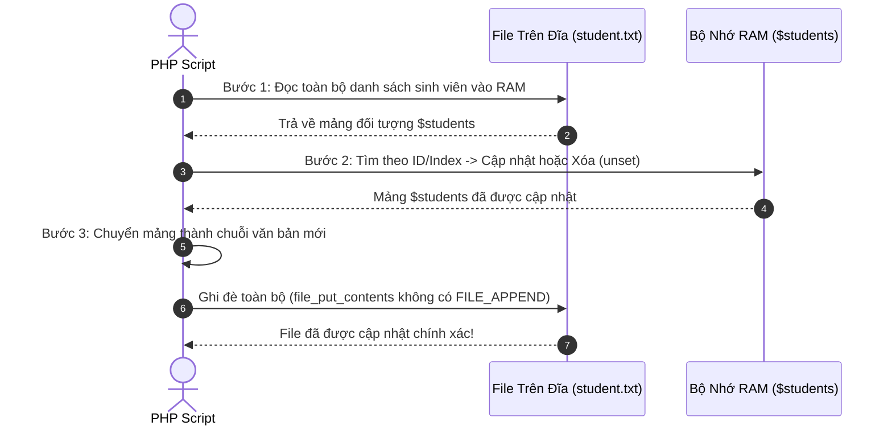

# Thao Tác Đọc & Ghi File Văn Bản Trong PHP

---

## 1. Bản Chất Lưu Trữ File Text & Luồng Dữ Liệu Tệp (File Stream)

### 1.1. Luồng Dữ Liệu Tệp & Ký Tự Ngắt Dòng

Tập tin văn bản (`.txt`, `.csv`, `.log`) trên hệ điều hành thực chất là một chuỗi byte liên tục được lưu trữ trên ổ cứng. Để phân định giữa các dòng văn bản, mỗi hệ điều hành sử dụng các ký tự điều khiển xuống dòng khác nhau:

- **Windows:** Sử dụng cặp 2 ký tự **`\r\n`** (Carriage Return `\r` mã ASCII 13 + Line Feed `\n` mã ASCII 10 - CRLF).
- **Linux / macOS / Unix:** Sử dụng 1 ký tự **`\n`** (Line Feed - LF).
- **Chuẩn mực trong PHP:** Luôn sử dụng hằng số **`PHP_EOL`** (PHP End-Of-Line). PHP sẽ tự động chọn ký tự ngắt dòng chính xác tương ứng với hệ điều hành của máy chủ đang chạy.

---

### 1.2. Các Mô Hình Lưu Trữ Dữ Liệu Có Cấu Trúc Bằng File Text

Khi chưa tích hợp hệ quản trị cơ sở dữ liệu (MySQL/PostgreSQL), ta tổ chức dữ liệu vào file text theo 2 mô hình phổ biến:

#### Mô Hình A: Khối Nhiều Dòng Liên Tiếp (Multi-line Record)

Mỗi đối tượng (sinh viên) chiếm $N$ dòng liên tiếp nhau trên file:

```text
Pham Minh       <-- Dòng 1: Họ tên
Ha Noi          <-- Dòng 2: Địa chỉ
18              <-- Dòng 3: Tuổi
Nguyen Du       <-- Dòng 4: Họ tên (SV tiếp theo)
Hue             <-- Dòng 5: Địa chỉ
20              <-- Dòng 6: Tuổi
```

#### Mô Hình B: Dòng Phân Cách (Delimited / CSV Format)

Mỗi đối tượng nằm trọn vẹn trên 1 dòng duy nhất, các trường cách nhau bởi ký tự phân tách (ví dụ dấu `|` hoặc `,`):

```text
Pham Minh|Ha Noi|18
Nguyen Du|Hue|20
```

---

### 1.3. Biểu Đồ Tuần Tự Toàn Bộ Luồng Đọc & Ghi File



---

## 2. Nhóm Hàm Kiểm Tra Trạng Thái & Đường Dẫn File

Trước khi thực hiện đọc hoặc ghi, bắt buộc phải kiểm tra trạng thái tệp để tránh phát sinh lỗi nghiêm trọng:

```php
$filePath = __DIR__ . '/../student.txt';

// 1. Kiểm tra file hoặc thư mục có tồn tại không
if (file_exists($filePath)) {
    // 2. Kiểm tra xem có đúng là file thông thường không (không phải là thư mục)
    if (is_file($filePath)) {
        // 3. Kiểm tra quyền đọc
        if (is_readable($filePath)) {
            echo "File có thể đọc được. Dung lượng: " . filesize($filePath) . " bytes";
        }
        // 4. Kiểm tra quyền ghi
        if (is_writable($filePath)) {
            echo "File có thể ghi được.";
        }
    }
}
```

| Tên Hàm             | Cú Pháp                              | Mô Tả & Giá Trị Trả Về                                              |
| :------------------ | :----------------------------------- | :------------------------------------------------------------------ |
| **`file_exists()`** | `file_exists(string $path): bool`    | Kiểm tra xem file hoặc thư mục có tồn tại trên đĩa không.           |
| **`is_file()`**     | `is_file(string $path): bool`        | Kiểm tra đường dẫn có thực sự là một file thông thường hay không.   |
| **`is_dir()`**      | `is_dir(string $path): bool`         | Kiểm tra đường dẫn có phải là một thư mục (directory) hay không.    |
| **`is_readable()`** | `is_readable(string $path): bool`    | Kiểm tra xem PHP có quyền đọc file/thư mục này không.               |
| **`is_writable()`** | `is_writable(string $path): bool`    | Kiểm tra xem PHP có quyền ghi đè / ghi tiếp vào file/thư mục không. |
| **`filesize()`**    | `filesize(string $path): int\|false` | Lấy kích thước file tính theo đơn vị **Byte**.                      |
| **`unlink()`**      | `unlink(string $path): bool`         | **Xóa hoàn toàn một file** khỏi ổ cứng.                             |

---

## 3. Các Phương Pháp ĐỌC File Trong PHP

### 3.1. Phương Pháp 1: Hàm `file()` (Đọc Từng Dòng Vào Mảng) ⭐

Hàm `file()` là lựa chọn tối ưu và tiện lợi nhất để đọc các file có cấu trúc theo từng dòng:

```php
array file(string $filename, int $flags = 0, ?resource $context = null)
```

#### Phân Tích Các Cờ (Flags) Cốt Lõi:

1. **`FILE_IGNORE_NEW_LINES`**: Loại bỏ ký tự xuống dòng (`\r`, `\n`) ở cuối mỗi phần tử mảng. Nếu thiếu cờ này, `$lines[0]` sẽ chứa chuỗi `"Pham Minh\r\n"`, dẫn đến việc so sánh chuỗi hoặc hiển thị bị lỗi định dạng.
2. **`FILE_SKIP_EMPTY_LINES`**: Tự động bỏ qua các dòng trống (dòng rỗng không có ký tự).

#### Thuật Toán Đọc Gom Nhóm Bản Ghi (Bước Nhảy `+3`):

```php
$filePath = __DIR__ . '/../student.txt';
$students = [];

if (file_exists($filePath)) {
    // Đọc tất cả các dòng hợp lệ vào mảng 1 chiều
    $lines = file($filePath, FILE_IGNORE_NEW_LINES | FILE_SKIP_EMPTY_LINES);
    $total = count($lines);

    // Duyệt mảng với bước nhảy $i += 3 để gom nhóm 3 dòng thành 1 sinh viên
    for ($i = 0; $i < $total; $i += 3) {
        $students[] = [
            'ten'    => $lines[$i] ?? '',
            'diachi' => $lines[$i + 1] ?? '',
            'tuoi'   => $lines[$i + 2] ?? ''
        ];
    }
}
```

---

### 3.2. Phương Pháp 2: Hàm `file_get_contents()` (Đọc Toàn Bộ File Thành Chuỗi)

- **Cú pháp:** `string|false file_get_contents(string $filename)`
- **Đặc điểm:** Đọc toàn bộ nội dung của file vào một biến chuỗi (string) duy nhất trong bộ nhớ RAM.
- **Ứng dụng:** Đọc file JSON (`json_decode(file_get_contents('data.json'), true)`), đọc file HTML mẫu, đọc dữ liệu API từ URL từ xa.

---

### 3.3. Phương Pháp 3: Con Trỏ File Stream Truyền Thống (`fopen` + `fgets` + `feof` + `fclose`)

Phương pháp này mở một luồng dữ liệu (Stream) và đọc tuần tự từng dòng. Nó **không nạp toàn bộ file vào RAM**, rất hữu ích khi đọc các file log khổng lồ hàng trăm Megabyte hoặc Gigabyte:

```php
$filePath = __DIR__ . '/../student.txt';
$students = [];

if (file_exists($filePath)) {
    $handle = fopen($filePath, "r"); // Mở file ở chế độ 'r' (Read)

    if ($handle) {
        // feof (File End-Of-File): Kiểm tra con trỏ đã đến cuối file chưa
        while (!feof($handle)) {
            $ten    = trim((string)fgets($handle)); // fgets đọc 1 dòng từ vị trí con trỏ
            $diachi = trim((string)fgets($handle));
            $tuoi   = trim((string)fgets($handle));

            if ($ten !== '') {
                $students[] = [
                    'ten'    => $ten,
                    'diachi' => $diachi,
                    'tuoi'   => $tuoi
                ];
            }
        }
        fclose($handle); // Bắt buộc đóng con trỏ để giải phóng tài nguyên
    }
}
```

---

## 4. Các Phương Pháp GHI File Trong PHP

### 4.1. Phương Pháp 1: Hàm `file_put_contents()` (Ghi Nhanh & An Toàn) ⭐

```php
int|false file_put_contents(string $filename, mixed $data, int $flags = 0, ?resource $context = null)
```

#### Phân Tích Các Cờ (Flags) Quan Trọng:

1. **`FILE_APPEND`**: **Ghi nối tiếp vào cuối file**. Nếu không có cờ này, hàm sẽ **xóa sạch toàn bộ nội dung cũ** và ghi đè nội dung mới từ đầu.
2. **`LOCK_EX`**: **Khóa độc quyền (Exclusive Lock)**. Đảm bảo trong khoảnh khắc file đang được ghi, không có tiến trình/người dùng nào khác được phép ghi cùng lúc, ngăn ngừa tuyệt đối lỗi hỏng dữ liệu (Data Corruption).

#### Code Mẫu Thêm Mới Sinh Viên Vào Cuối File:

```php
$filePath = __DIR__ . '/../student.txt';

// 1. Chuẩn bị nội dung 3 dòng kết thúc bằng ký tự ngắt dòng chuẩn
$content = $ten . PHP_EOL . $diachi . PHP_EOL . intval($tuoi) . PHP_EOL;

// 2. Thực hiện ghi nối tiếp vào cuối file kèm khóa an toàn
$bytes = file_put_contents($filePath, $content, FILE_APPEND | LOCK_EX);

if ($bytes !== false) {
    echo "Đã lưu thành công {$bytes} bytes vào file!";
}
```

---

### 4.2. Phương Pháp 2: Con Trỏ File Ghi Tiếp (`fopen` với Mode `'a'` + `fwrite` + `fclose`)

```php
$filePath = __DIR__ . '/../student.txt';
$handle = fopen($filePath, "a"); // Mode 'a' = Append (Ghi tiếp vào cuối)

if ($handle) {
    if (flock($handle, LOCK_EX)) { // Khóa file trước khi ghi
        fwrite($handle, $ten . PHP_EOL);
        fwrite($handle, $diachi . PHP_EOL);
        fwrite($handle, intval($tuoi) . PHP_EOL);
        flock($handle, LOCK_UN); // Mở khóa sau khi ghi xong
    }
    fclose($handle); // Đóng file
}
```

---

## 5. Bảng Tra Cứu Toàn Bộ Các Chế Độ Mở File (`fopen` Modes)

| Mode       | Mục Đích                | Vị Trí Con Trỏ Ban Đầu | Nếu File **ĐÃ TỒN TẠI**                   | Nếu File **CHƯA TỒN TẠI**       |
| :--------- | :---------------------- | :--------------------- | :---------------------------------------- | :------------------------------ |
| **`'r'`**  | **Chỉ Đọc** (Read)      | Đầu file               | Giữ nguyên nội dung                       | **Phát cảnh báo lỗi `Warning`** |
| **`'r+'`** | **Đọc và Ghi**          | Đầu file               | Giữ nguyên nội dung, ghi đè từ đầu        | **Phát cảnh báo lỗi `Warning`** |
| **`'w'`**  | **Chỉ Ghi** (Write)     | Đầu file               | **XÓA SẠCH TOÀN BỘ NỘI DUNG VỀ 0 BYTE**   | Tự động tạo file mới            |
| **`'w+'`** | **Đọc và Ghi đè**       | Đầu file               | **XÓA SẠCH TOÀN BỘ NỘI DUNG VỀ 0 BYTE**   | Tự động tạo file mới            |
| **`'a'`**  | **Ghi tiếp** (Append)   | **Cuối file**          | Giữ nguyên nội dung cũ, ghi nối tiếp      | Tự động tạo file mới            |
| **`'a+'`** | **Đọc và Ghi tiếp**     | Cuối file khi ghi      | Giữ nguyên nội dung cũ                    | Tự động tạo file mới            |
| **`'x'`**  | **Tạo mới và Ghi**      | Đầu file               | **Phát lỗi `Warning` (Chỉ tạo file mới)** | Tự động tạo file mới            |
| **`'x+'`** | **Tạo mới, Đọc và Ghi** | Đầu file               | **Phát lỗi `Warning`**                    | Tự động tạo file mới            |

---

## 6. Quy Trình Cập Nhật (Update) & Xóa (Delete) Bản Ghi Trong File Text

Do file text không có các câu lệnh `UPDATE` hay `DELETE` như cơ sở dữ liệu SQL, quy trình chuẩn để sửa/xóa bản ghi trong file text gồm 3 bước:



#### Code Cài Đặt Mẫu (Xóa Sinh Viên Theo Vị Trí Index):

```php
function xoaSinhVien(int $indexToDelete, string $filePath): bool
{
    if (!file_exists($filePath)) return false;

    // 1. Đọc tất cả dòng vào mảng
    $lines = file($filePath, FILE_IGNORE_NEW_LINES | FILE_SKIP_EMPTY_LINES);
    $students = [];
    $total = count($lines);

    for ($i = 0; $i < $total; $i += 3) {
        $students[] = [
            'ten'    => $lines[$i] ?? '',
            'diachi' => $lines[$i + 1] ?? '',
            'tuoi'   => $lines[$i + 2] ?? ''
        ];
    }

    // 2. Xóa sinh viên tại chỉ số chỉ định
    if (isset($students[$indexToDelete])) {
        unset($students[$indexToDelete]);
    } else {
        return false;
    }

    // 3. Tái cấu trúc lại chuỗi dữ liệu
    $newContent = '';
    foreach ($students as $sv) {
        $newContent .= $sv['ten'] . PHP_EOL . $sv['diachi'] . PHP_EOL . $sv['tuoi'] . PHP_EOL;
    }

    // 4. Ghi đè lại toàn bộ file (không dùng FILE_APPEND)
    return file_put_contents($filePath, $newContent, LOCK_EX) !== false;
}
```
