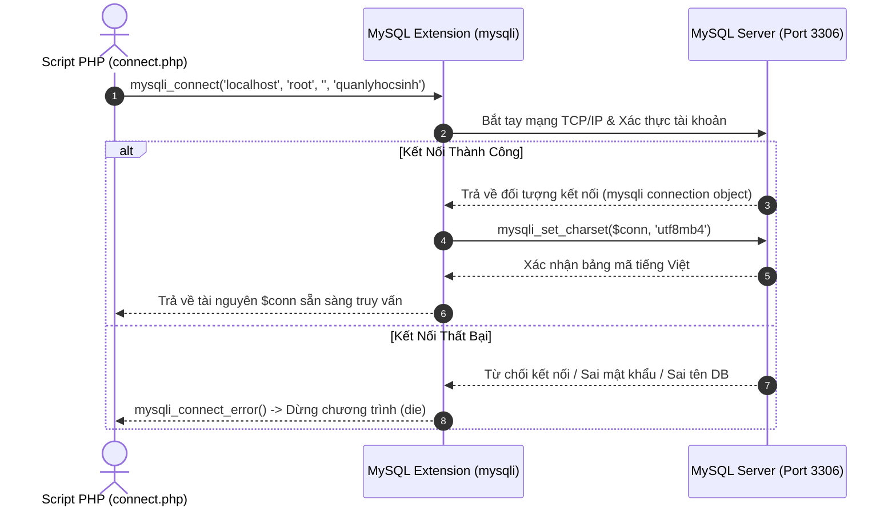

# Kết Nối & Thao Tác Cơ Sở Dữ Liệu MySQL Trong PHP

---

## 1. Giới Thiệu Hệ Quản Trị CSDL MySQL & MariaDB Trong XAMPP

### 1.1. XAMPP Là Gì Và Vai Trò Của MySQL

**XAMPP** là một bộ công cụ máy chủ cục bộ (Local Web Server) đóng gói sẵn bao gồm:
- **X** (Cross-Platform): Chạy đa nền tảng (Windows, Linux, macOS).
- **A** (Apache): Web Server xử lý các yêu cầu HTTP.
- **M** (MySQL / MariaDB): Hệ quản trị cơ sở dữ liệu quan hệ (RDBMS) lưu trữ và xử lý dữ liệu có cấu trúc.
- **P** (PHP): Ngôn ngữ lập trình kịch bản phía máy chủ.
- **P** (Perl): Ngôn ngữ kịch bản hỗ trợ.

Trong môi trường XAMPP, tiến trình MySQL chạy dưới dạng một dịch vụ mạng (Service) lắng nghe tại cổng mặc định **Port `3306`**.

---

### 1.2. Công Cụ Quản Trị phpMyAdmin

**phpMyAdmin** là một ứng dụng web mã nguồn mở được viết bằng PHP, cung cấp giao diện đồ họa (GUI) trực quan giúp người lập trình dễ dàng quản lý hệ thống MySQL mà không cần phải gõ lệnh Command Line phức tạp:
- **Địa chỉ truy cập mặc định:** `http://localhost/phpmyadmin/`
- **Các tính năng cốt lõi:**
  - Tạo mới, sửa, xóa Database (Cơ sở dữ liệu) và Table (Bảng).
  - Thêm, sửa, xóa, tìm kiếm dữ liệu trực quan.
  - Nhập (Import) và Xuất (Export) dữ liệu dưới dạng tập tin mã nguồn `.sql`.
  - Quản lý tài khoản người dùng và phân quyền (Privileges).

---

### 1.3. Thông Số Kết Nối Mặc Định Trong XAMPP

Khi cài đặt XAMPP mặc định, máy chủ MySQL được thiết lập sẵn các thông số sau:

| Thông Số (Parameter) | Giá Trị Mặc Định Trong XAMPP | Ghi Chú |
| :--- | :--- | :--- |
| **Database Host (Server)** | `localhost` hoặc `127.0.0.1` | Máy chủ cơ sở dữ liệu đang nằm cùng máy với Web Server. |
| **Port** | `3306` | Cổng dịch vụ chuẩn của MySQL. |
| **Username** | `root` | Tài khoản quản trị viên tối cao (Superuser) có toàn quyền. |
| **Password** | `""` (Để trống / Rỗng) | XAMPP mặc định không đặt mật khẩu cho tài khoản `root`. |
| **Database Name** | *(Tên database bạn tự tạo)* | Ví dụ: `quanlyhocsinh`. |

---

## 2. Các Kiểu Dữ Liệu Phổ Biến Trong MySQL

Khi thiết kế bảng (Table), việc chọn đúng kiểu dữ liệu giúp tối ưu hóa dung lượng lưu trữ trên ổ cứng và tăng tốc độ truy vấn:

### 2.1. Nhóm Kiểu Chuỗi Ký Tự (String Data Types)
- **`CHAR(n)`:** Chuỗi có **độ dài cố định** $n$ ký tự ($0 \le n \le 255$). Nếu chuỗi ngắn hơn $n$, MySQL sẽ tự bù thêm khoảng trắng vào cuối. Thích hợp cho các trường có độ dài bất biến như Mã sinh viên (`CHAR(8)`), Mã lớp (`CHAR(6)`), Mã bưu chính, Mã màu hex.
- **`VARCHAR(n)`:** Chuỗi có **độ dài biến thiên** tối đa $n$ ký tự. Chỉ tiêu tốn đúng số byte của chuỗi thực tế. Thích hợp cho Họ tên (`VARCHAR(50)`), Địa chỉ (`VARCHAR(150)`), Tiêu đề bài viết.
- **`TEXT`:** Lưu trữ văn bản dài (tối đa 65.535 ký tự), thích hợp cho Nội dung bài viết, Ghi chú, Bình luận.

### 2.2. Nhóm Kiểu Số (Numeric Data Types)
- **`INT` / `INTEGER`:** Số nguyên 4 byte (từ -2.147.483.648 đến 2.147.483.647). Thích hợp cho Khóa học, Năm sinh, Số lượng, ID.
- **`FLOAT` / `DOUBLE`:** Số thực dấu chấm động (số xấp xỉ). Thích hợp cho Điểm số môn học (`DIEMTOAN FLOAT`), Tọa độ GPS.
- **`DECIMAL(M, D)`:** Số thập phân có **độ chính xác tuyệt đối** (M là tổng số chữ số, D là số chữ số sau dấu phẩy). Bắt buộc sử dụng cho **Tiền tệ, Giá sản phẩm, Tài chính** (ví dụ `DECIMAL(12, 2)` lưu được đến hàng tỷ đồng).

### 2.3. Nhóm Kiểu Ngày Giờ (Date & Time)
- **`DATE`:** Lưu trữ Ngày - Tháng - Năm theo định dạng chuẩn **`YYYY-MM-DD`** (Ví dụ: `2000-01-01`).
- **`DATETIME`:** Lưu trữ Ngày giờ theo định dạng **`YYYY-MM-DD HH:MM:SS`**.

### 2.4. Các Ràng Buộc (Constraints) Quan Trọng
- **`PRIMARY KEY` (Khóa chính):** Định danh duy nhất cho mỗi bản ghi trong bảng, không được phép trùng lặp và không được nhận giá trị `NULL`.
- **`FOREIGN KEY` (Khóa ngoại):** Thiết lập mối quan hệ ràng buộc giữa 2 bảng (ví dụ: cột `LOP` của bảng `HOSO` tham chiếu đến cột `MALOP` của bảng `LOP`). Ngăn chặn việc nhập mã lớp không tồn tại hoặc xóa lớp đang có học sinh.
- **`NOT NULL`:** Bắt buộc trường này phải có giá trị, không được để trống.
- **`AUTO_INCREMENT`:** Cột số nguyên tự động tăng thêm 1 mỗi khi có bản ghi mới được thêm vào.

---

## 3. Các Câu Lệnh SQL Cốt Lõi (DDL & DML)

### 3.1. DDL: Khởi Tạo Cơ Sở Dữ Liệu & Bảng

```sql
-- 1. Tạo Database
CREATE DATABASE IF NOT EXISTS quanlyhocsinh CHARACTER SET utf8mb4 COLLATE utf8mb4_unicode_ci;
USE quanlyhocsinh;

-- 2. Tạo bảng Lớp (Table 1)
CREATE TABLE LOP (
    MALOP CHAR(6) PRIMARY KEY,
    TENLOP VARCHAR(50) NOT NULL,
    KHOAHOC INT,
    GVCN VARCHAR(50)
);

-- 3. Tạo bảng Hồ Sơ Học Sinh có Khóa ngoại (Table N)
CREATE TABLE HOSO (
    MAHS CHAR(8) PRIMARY KEY,
    HOTEN VARCHAR(50) NOT NULL,
    NGAYSINH DATE,
    DIACHI VARCHAR(150),
    LOP CHAR(6),
    DIEMTOAN FLOAT DEFAULT 0,
    DIEMLY FLOAT DEFAULT 0,
    DIEMHOA FLOAT DEFAULT 0,
    FOREIGN KEY (LOP) REFERENCES LOP(MALOP)
);
```

---

### 3.2. DML: 4 Câu Lệnh Thao Tác Dữ Liệu CRUD Kinh Điển

```sql
-- C (Create): Thêm mới bản ghi
INSERT INTO LOP (MALOP, TENLOP, KHOAHOC, GVCN) 
VALUES ('CNTT1', 'Công nghệ thông tin 1', 15, 'Thầy Nguyễn Văn A');

-- R (Read): Truy vấn lấy dữ liệu
SELECT * FROM HOSO WHERE LOP = 'CNTT1' ORDER BY HOTEN ASC;

-- U (Update): Cập nhật dữ liệu có điều kiện WHERE
UPDATE LOP 
SET TENLOP = 'Kỹ thuật phần mềm 1', GVCN = 'Cô Trần Thị B' 
WHERE MALOP = 'CNTT1';

-- D (Delete): Xóa bản ghi có điều kiện WHERE
DELETE FROM HOSO WHERE MAHS = 'HS01';
```

---

## 4. Kết Nối MySQL Bằng Thư Viện `mysqli` Trong PHP

PHP cung cấp extension **`mysqli` (MySQL Improved)** chuyên dụng để làm việc với MySQL với hiệu năng cực cao.



### Mã Nguồn File Kết Nối Chuẩn (`connect.php`):

```php
<?php
$servername = "localhost";
$username   = "root";
$password   = "";
$dbname     = "quanlyhocsinh";

// 1. Tạo kết nối tới máy chủ MySQL
$conn = mysqli_connect($servername, $username, $password, $dbname);

// 2. Kiểm tra trạng thái kết nối
if (!$conn) {
    die("Kết nối cơ sở dữ liệu thất bại: " . mysqli_connect_error());
}

// 3. Thiết lập font chữ tiếng Việt có dấu chuẩn UTF-8
mysqli_set_charset($conn, "utf8mb4");
?>
```

---

## 5. Thực Thi Truy Vấn & Nhận Dữ Liệu Trong PHP

### 5.1. Bảng Tra Cứu Các Hàm `mysqli` Cốt Lõi

| Tên Hàm | Cú Pháp | Chức Năng & Giá Trị Trả Về |
| :--- | :--- | :--- |
| **`mysqli_query()`** | `mysqli_query($conn, string $sql)` | Thực thi câu lệnh SQL. Trả về `mysqli_result` (nếu là `SELECT`) hoặc `bool` (nếu là `INSERT/UPDATE/DELETE`). |
| **`mysqli_num_rows()`** | `mysqli_num_rows($result): int` | Đếm tổng số lượng bản ghi trả về từ câu lệnh `SELECT`. |
| **`mysqli_fetch_assoc()`**| `mysqli_fetch_assoc($result): ?array`| Lấy 1 dòng kết quả tiếp theo dưới dạng **Mảng kết hợp** (Key là tên cột: `$row['HOTEN']`). ⭐ Khuyên dùng |
| **`mysqli_fetch_all()`** | `mysqli_fetch_all($result, MYSQLI_ASSOC)` | Đọc toàn bộ kết quả vào một mảng 2 chiều duy nhất. |
| **`mysqli_insert_id()`** | `mysqli_insert_id($conn): int\|string` | Lấy giá trị khóa chính `AUTO_INCREMENT` của bản ghi vừa được `INSERT` thành công. |
| **`mysqli_affected_rows()`**| `mysqli_affected_rows($conn): int` | Lấy số dòng thực sự bị thay đổi bởi lệnh `INSERT/UPDATE/DELETE`. |
| **`mysqli_error()`** | `mysqli_error($conn): string` | Trả về chuỗi mô tả lỗi chi tiết nhất từ MySQL Server. |
| **`mysqli_close()`** | `mysqli_close($conn): bool` | Đóng kết nối để giải phóng tài nguyên mạng và bộ nhớ. |

---

### 5.2. Mẫu Đọc Dữ Liệu Bằng Vòng Lặp `while (mysqli_fetch_assoc)`:

```php
<?php
require_once __DIR__ . '/connect.php';

$sql = "SELECT MALOP, TENLOP, KHOAHOC, GVCN FROM LOP ORDER BY MALOP ASC";
$result = mysqli_query($conn, $sql);

if ($result && mysqli_num_rows($result) > 0) {
    // Duyệt qua từng dòng kết quả cho đến khi con trỏ về null
    while ($row = mysqli_fetch_assoc($result)) {
        echo "Mã: " . htmlspecialchars($row['MALOP']) . " - Tên: " . htmlspecialchars($row['TENLOP']) . "<br>";
    }
    // Giải phóng bộ nhớ kết quả sau khi dùng xong
    mysqli_free_result($result);
} else {
    echo "Chưa có dữ liệu lớp học!";
}

// Đóng kết nối
mysqli_close($conn);
?>
```

---

## 6. Thuật Toán Phân Trang Dữ Liệu Bằng Mệnh Đề `LIMIT` (Pagination)

Khi cơ sở dữ liệu có hàng ngàn hoặc hàng triệu bản ghi, việc load toàn bộ ra một trang web sẽ làm treo trình duyệt và quá tải server. Kỹ thuật **Phân trang (Pagination)** chia dữ liệu thành nhiều trang nhỏ (ví dụ 10 dòng/trang).

```mermaid
sequenceDiagram
    autonumber
    actor User as Trình Duyệt Client
    participant PHP as Script PHP (hoso_list.php)
    participant MySQL as MySQL Database

    User->>PHP: Yêu cầu xem Trang số 2 (GET ?page=2)
    PHP->>PHP: Cấu hình: $limit = 10; $page = 2
    PHP->>PHP: Tính vị trí bắt đầu: $start = (2 - 1) * 10 = 10
    PHP->>MySQL: 1. Đếm tổng số: SELECT COUNT(MAHS) FROM HOSO
    MySQL-->>PHP: Trả về total = 25 bản ghi -> Tính $total_pages = ceil(25/10) = 3 trang
    PHP->>MySQL: 2. Lấy dữ liệu trang 2: SELECT * FROM HOSO LIMIT 10, 10
    MySQL-->>PHP: Trả về 10 bản ghi từ vị trí thứ 11 đến 20
    PHP-->>User: Kết xuất HTML Bảng dữ liệu + Thanh điều hướng [1] [2] [3]
```

### 6.1. Công Thức Toán Học Cốt Lõi:

1. **Vị trí bắt đầu lấy trong CSDL (Offset - `$start`):**
   $$\text{\$start} = (\text{\$page} - 1) \times \text{\$limit}$$
   - *Trang 1:* `$start = (1 - 1) * 10 = 0` $\rightarrow$ Lấy từ bản ghi thứ `0` (10 dòng).
   - *Trang 2:* `$start = (2 - 1) * 10 = 10` $\rightarrow$ Lấy từ bản ghi thứ `10` (10 dòng).
   - *Trang 3:* `$start = (3 - 1) * 10 = 20` $\rightarrow$ Lấy từ bản ghi thứ `20` (10 dòng).

2. **Tính tổng số trang (`$total_pages`):**
   $$\text{\$total\_pages} = \text{ceil}\left(\frac{\text{Tổng số bản ghi}}{\text{\$limit}}\right)$$
   *(Hàm `ceil()` dùng để làm tròn lên: 21 bản ghi chia 10 = 2.1 $\rightarrow$ thành 3 trang).*

### 6.2. Mã Nguồn Cài Đặt Phân Trang Chuẩn Mực:

```php
<?php
require_once __DIR__ . '/connect.php';

// 1. Cấu hình phân trang
$limit = 10; // 10 bản ghi trên 1 trang
$currentPage = isset($_GET['page']) ? max(1, intval($_GET['page'])) : 1;
$start = ($currentPage - 1) * $limit;

// 2. Đếm tổng số bản ghi trong bảng
$sql_count = "SELECT COUNT(MAHS) AS total FROM HOSO";
$res_count = mysqli_query($conn, $sql_count);
$row_count = mysqli_fetch_assoc($res_count);
$totalRecords = intval($row_count['total'] ?? 0);
$totalPages = (int)ceil($totalRecords / $limit);

// 3. Lấy dữ liệu cho trang hiện tại bằng mệnh đề LIMIT
$sql = "SELECT * FROM HOSO LIMIT {$start}, {$limit}";
$result = mysqli_query($conn, $sql);
?>

<!-- Hiển thị bảng dữ liệu -->
<table border="1" style="width: 100%; border-collapse: collapse;">
    <thead>
        <tr>
            <th>Mã HS</th>
            <th>Họ Tên</th>
            <th>Ngày Sinh</th>
            <th>Lớp</th>
            <th>Điểm Toán</th>
            <th>Điểm Lý</th>
            <th>Điểm Hóa</th>
        </tr>
    </thead>
    <tbody>
        <?php while ($row = mysqli_fetch_assoc($result)): ?>
            <tr>
                <td><?= htmlspecialchars($row['MAHS']) ?></td>
                <td><?= htmlspecialchars($row['HOTEN']) ?></td>
                <td><?= htmlspecialchars($row['NGAYSINH']) ?></td>
                <td><?= htmlspecialchars($row['LOP']) ?></td>
                <td><?= $row['DIEMTOAN'] ?></td>
                <td><?= $row['DIEMLY'] ?></td>
                <td><?= $row['DIEMHOA'] ?></td>
            </tr>
        <?php endwhile; ?>
    </tbody>
</table>

<!-- Thanh liên kết phân trang -->
<div class="pagination" style="text-align: center; margin-top: 15px;">
    Trang: 
    <?php for ($i = 1; $i <= $totalPages; $i++): ?>
        <a href="index.php?page=hoso_list&p=<?= $i ?>" style="<?= ($currentPage === $i) ? 'font-weight: bold; color: red;' : '' ?>">
            [<?= $i ?>]
        </a>
    <?php endfor; ?>
</div>
```

---

## 7. Cảnh Báo An Ninh: Phòng Chống Tấn Công SQL Injection (SQLi)

* **LỖ TRỔNG CHẾT NGƯỜI (Nối chuỗi trực tiếp):**
  ```php
  // CỰC KỲ NGUY HIỂM - DỄ BỊ HACK TOÀN BỘ CSDL
  $id = $_GET['id'];
  $sql = "SELECT * FROM LOP WHERE MALOP = '$id'";
  ```
  Nếu kẻ tấn công truyền URL: `?id=' OR '1'='1`, câu lệnh SQL sẽ trở thành `SELECT * FROM LOP WHERE MALOP = '' OR '1'='1'`, làm lộ toàn bộ dữ liệu hoặc có thể bị chèn lệnh xóa trắng bảng.
* **GIẢI PHÁP PHÒNG THỦ:**
  1. **Với tham số kiểu số:** Luôn ép kiểu `intval($_GET['id'])`.
  2. **Với chuỗi:** Luôn bọc qua hàm `mysqli_real_escape_string($conn, $str)` trước khi gắn vào câu SQL.
  3. **Chuẩn mực cao cấp:** Sử dụng **Prepared Statements** (`mysqli_prepare()` và `mysqli_stmt_bind_param()`).
