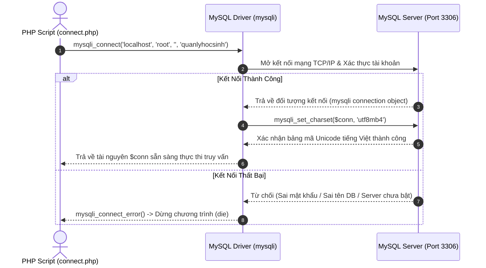
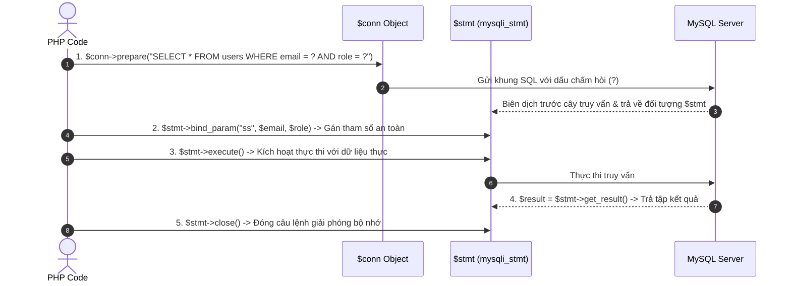

# Kết Nối & Thao Tác Cơ Sở Dữ Liệu MySQL Trong PHP

---

## 1. Bản Chất Hệ Quản Trị CSDL MySQL & Môi Trường XAMPP

### 1.1. Khái Niệm Cơ Bản Về MySQL & MariaDB

**MySQL** là Hệ quản trị cơ sở dữ liệu quan hệ mã nguồn mở (RDBMS - Relational Database Management System) phổ biến nhất thế giới trong phát triển web. Trong bộ công cụ XAMPP hiện đại, hệ CSDL được tích hợp là **MariaDB** — một bản nâng cấp hoàn toàn tương thích 100% với chuẩn MySQL về cả cú pháp SQL, chuẩn giao thức mạng và các hàm kết nối PHP.

Mô hình hoạt động của MySQL dựa trên kiến trúc **Client - Server**:

- **MySQL Server (`mysqld.exe`):** Tiến trình dịch vụ chạy ngầm trên máy chủ, lắng nghe tại cổng mạng mặc định **Port `3306`**, chịu trách nhiệm quản lý cấu trúc bảng, cấp phát bộ nhớ đệm, tối ưu hóa truy vấn và ghi dữ liệu nhị phân xuống ổ cứng.
- **MySQL Client (PHP Engine / phpMyAdmin / CLI):** Ứng dụng gửi các câu lệnh truy vấn SQL qua giao thức TCP/IP tới Server và nhận về tập kết quả dữ liệu.

---

### 1.2. Cấu Trúc Thư Mục Cốt Lõi Của MySQL Trong XAMPP

Toàn bộ hệ thống máy chủ MySQL được cài đặt tại đường dẫn `C:\xampp\mysql\`:

```
C:\xampp\mysql\
│
├── bin/                     # Thư mục chứa các công cụ dòng lệnh thực thi
│   ├── mysqld.exe           # File máy chủ MySQL Daemon (khởi động khi bấm Start trên XAMPP)
│   ├── mysql.exe            # Chương trình Command Line Client để gõ lệnh SQL trực tiếp
│   ├── mysqldump.exe        # Công cụ sao lưu, xuất (Export) cơ sở dữ liệu ra file .sql
│   └── my.ini               # TẬP TIN CẤU HÌNH TRUNG TÂM của MySQL Server
│
├── data/                    # NƠI LƯU TRỮ TOÀN BỘ CƠ SỞ DỮ LIỆU THỰC TẾ TRÊN Ổ CỨNG
│   ├── ibdata1              # Tệp dữ liệu dùng chung của bộ máy lưu trữ InnoDB
│   ├── ib_logfile0          # Tệp nhật ký giao dịch (Transaction Log)
│   ├── mysql/               # CSDL hệ thống lưu thông tin tài khoản người dùng và phân quyền
│   ├── phpmyadmin/          # CSDL lưu cấu hình của ứng dụng web phpMyAdmin
│   └── quanlyhocsinh/       # Thư mục riêng chứa bảng dữ liệu của Database 'quanlyhocsinh'
│
└── backup/                  # Bản sao lưu cấu hình nguyên bản để cứu hộ khi data/ bị lỗi
```

---

### 1.3. Bảng Thông Số Kết Nối Mặc Định Trong XAMPP

| Thông Số Kết Nối           | Giá Trị Mặc Định Trong XAMPP   | Ý Nghĩa Kỹ Thuật                                                                 |
| :------------------------- | :----------------------------- | :------------------------------------------------------------------------------- |
| **Database Host (Server)** | `localhost` hoặc `127.0.0.1`   | Máy chủ cơ sở dữ liệu đang nằm cùng máy tính với Web Server Apache.              |
| **Port**                   | `3306`                         | Cổng mạng tiêu chuẩn của dịch vụ MySQL Server qua giao thức TCP/IP.              |
| **Username**               | `root`                         | Tài khoản quản trị viên tối cao (Superadmin) sở hữu toàn quyền `ALL PRIVILEGES`. |
| **Password**               | `""` _(Chuỗi rỗng / để trống)_ | XAMPP mặc định không cài đặt mật khẩu cho tài khoản `root`.                      |
| **Database Name**          | _(Tên CSDL bạn tự tạo)_        | Ví dụ: `quanlyhocsinh`.                                                          |

---

## 2. Thiết Kế Cơ Sở Dữ Liệu Quan Hệ (RDBMS Foundations)

### 2.1. Các Kiểu Dữ Liệu Cốt Lõi Trong MySQL

Việc lựa chọn đúng kiểu dữ liệu giúp tối ưu dung lượng lưu trữ trên đĩa cứng và tăng tốc độ xử lý câu lệnh truy vấn:

#### A. Nhóm Kiểu Chuỗi Ký Tự (String Types)

- **`CHAR(n)`:** Chuỗi có **độ dài cố định** đúng $n$ ký tự ($0 \le n \le 255$). Nếu chuỗi nạp vào ngắn hơn $n$, MySQL tự động thêm khoảng trắng vào cuối. Dùng cho các trường có độ dài bất biến: Mã sinh viên (`CHAR(8)`), Mã lớp (`CHAR(6)`), Mã quốc gia (`CHAR(2)`), Mã màu Hex (`CHAR(7)`).
- **`VARCHAR(n)`:** Chuỗi có **độ dài biến thiên** tối đa $n$ ký tự ($0 \le n \le 65.535$). Chỉ tiêu tốn đúng số byte thực tế của chuỗi cộng thêm 1-2 byte chỉ độ dài. Thích hợp cho: Họ và tên (`VARCHAR(50)`), Địa chỉ (`VARCHAR(150)`), Tiêu đề bài viết.
- **`TEXT`:** Lưu trữ văn bản dài (tối đa 64 KB), thích hợp cho Nội dung bài viết, Ghi chú, Mô tả chi tiết.

#### B. Nhóm Kiểu Số (Numeric Types)

- **`INT` / `INTEGER`:** Số nguyên 4 byte (phạm vi từ $-2.147.483.648$ đến $2.147.483.647$). Thích hợp cho: Khóa học, Số lượng, Năm sinh, ID tự tăng.
- **`FLOAT` / `DOUBLE`:** Số thực dấu chấm động (số xấp xỉ). Thích hợp cho: Điểm thi (`DIEMTOAN FLOAT`), Tọa độ GPS.
- **`DECIMAL(M, D)`:** Số thập phân có **độ chính xác tuyệt đối** ($M$ là tổng số chữ số, $D$ là số chữ số sau dấu phẩy). Bắt buộc sử dụng cho **Tiền tệ, Giá sản phẩm, Tài chính ngân hàng** (ví dụ `DECIMAL(12, 2)` lưu được đến hàng trăm tỷ đồng mà không bị sai số làm tròn).

#### C. Nhóm Kiểu Ngày Giờ (Date & Time Types)

- **`DATE`:** Lưu trữ Ngày - Tháng - Năm theo định dạng chuẩn quốc tế **`YYYY-MM-DD`** (Ví dụ: `2004-05-12`).
- **`DATETIME`:** Lưu trữ Ngày giờ đầy đủ theo định dạng **`YYYY-MM-DD HH:MM:SS`**.

---

### 2.2. Các Ràng Buộc Toàn Vẹn Dữ Liệu (Constraints)

- **`PRIMARY KEY` (Khóa chính):** Định danh duy nhất cho mỗi bản ghi trong bảng, bắt buộc không được trùng lặp và không được nhận giá trị `NULL`.
- **`FOREIGN KEY` (Khóa ngoại):** Ràng buộc liên kết giữa 2 bảng (Ví dụ: cột `LOP` trong bảng `HOSO` tham chiếu tới cột `MALOP` trong bảng `LOP`). Ngăn chặn việc nhập mã lớp không tồn tại.
- **`NOT NULL`:** Bắt buộc trường này phải có giá trị khi thêm mới bản ghi.
- **`AUTO_INCREMENT`:** Cột số nguyên tự động tăng thêm 1 mỗi khi có bản ghi mới được chèn vào bảng.

---

## 3. Cú Pháp SQL Khởi Tạo & Thao Tác Dữ Liệu (DDL & DML)

### 3.1. DDL: Tạo Cơ Sở Dữ Liệu & Cấu Trúc Bảng Có Khóa Ngoại

```sql
-- 1. Tạo Database với bảng mã tiếng Việt chuẩn UTF-8
CREATE DATABASE IF NOT EXISTS quanlyhocsinh CHARACTER SET utf8mb4 COLLATE utf8mb4_unicode_ci;
USE quanlyhocsinh;

-- 2. Tạo bảng Cha: LOP
CREATE TABLE LOP (
    MALOP CHAR(6) PRIMARY KEY,
    TENLOP VARCHAR(50) NOT NULL,
    KHOAHOC INT,
    GVCN VARCHAR(50)
) ENGINE=InnoDB DEFAULT CHARSET=utf8mb4 COLLATE=utf8mb4_unicode_ci;

-- 3. Tạo bảng Con: HOSO (Có khóa ngoại tham chiếu LOP)
CREATE TABLE HOSO (
    MAHS CHAR(8) PRIMARY KEY,
    HOTEN VARCHAR(50) NOT NULL,
    NGAYSINH DATE,
    DIACHI VARCHAR(150),
    LOP CHAR(6),
    DIEMTOAN FLOAT DEFAULT 0,
    DIEMLY FLOAT DEFAULT 0,
    DIEMHOA FLOAT DEFAULT 0,
    CONSTRAINT fk_hoso_lop FOREIGN KEY (LOP) REFERENCES LOP(MALOP)
    ON UPDATE CASCADE ON DELETE RESTRICT
) ENGINE=InnoDB DEFAULT CHARSET=utf8mb4 COLLATE=utf8mb4_unicode_ci;
```

---

### 3.2. DML: 4 Câu Lệnh Thao Tác Dữ Liệu CRUD

```sql
-- C (Create): Thêm mới bản ghi vào bảng
INSERT INTO LOP (MALOP, TENLOP, KHOAHOC, GVCN)
VALUES ('CNTT1', 'Công nghệ thông tin 1', 15, 'Thầy Nguyễn Văn An');

-- R (Read): Đọc dữ liệu kèm Nối bảng (INNER JOIN)
SELECT H.MAHS, H.HOTEN, H.NGAYSINH, L.TENLOP, H.DIEMTOAN, H.DIEMLY, H.DIEMHOA,
       ROUND((H.DIEMTOAN + H.DIEMLY + H.DIEMHOA) / 3, 2) AS DTB
FROM HOSO H
INNER JOIN LOP L ON H.LOP = L.MALOP
ORDER BY H.HOTEN ASC;

-- U (Update): Cập nhật dữ liệu có điều kiện WHERE
UPDATE LOP
SET TENLOP = 'Công nghệ phần mềm 1', GVCN = 'Cô Trần Thị Bích'
WHERE MALOP = 'CNTT1';

-- D (Delete): Xóa bản ghi có điều kiện WHERE
DELETE FROM HOSO WHERE MAHS = 'HS0001';
```

---

## 4. Chu Trình Kết Nối MySQL Trong PHP Bằng Thư Viện `mysqli`

PHP cung cấp extension **`mysqli` (MySQL Improved)** với hiệu năng cao, bảo mật và hỗ trợ đầy đủ các tính năng hiện đại của MySQL Server.



### 4.1. Mã Nguồn Kết Nối: Hướng Thủ Tục (Procedural) vs Hướng Đối Tượng (OOP)

Trong PHP, thư viện `mysqli` hỗ trợ cả 2 phong cách lập trình: **Hướng thủ tục** (hàm riêng lẻ `mysqli_*`) và **Hướng đối tượng** (sử dụng đối tượng `$conn->...`).

```php
<?php
// Thiết lập thông số kết nối
$servername = "localhost";
$username   = "root";
$password   = "";
$dbname     = "quanlyhocsinh";

// -------------------------------------------------------------
// CÁCH 1: HƯỚNG ĐỐI TƯỢNG (OOP - Khuyên dùng trong dự án hiện đại)
// -------------------------------------------------------------
$conn = new mysqli($servername, $username, $password, $dbname);

// Kiểm tra lỗi kết nối qua thuộc tính $conn->connect_error
if ($conn->connect_error) {
    die("Lỗi kết nối cơ sở dữ liệu: " . $conn->connect_error);
}

// Thiết lập bảng mã tiếng Việt UTF-8
$conn->set_charset("utf8mb4");

// -------------------------------------------------------------
// CÁCH 2: HƯỚNG THỦ TỤC (Procedural - Phổ biến trong giáo trình cũ)
// -------------------------------------------------------------
/*
$conn = mysqli_connect($servername, $username, $password, $dbname);
if (!$conn) {
    die("Lỗi kết nối cơ sở dữ liệu: " . mysqli_connect_error());
}
mysqli_set_charset($conn, "utf8mb4");
*/
?>
```

---

## 5. Cẩm Nang Cú Pháp Thao Tác CSDL: OOP (`$conn->...`) & Thủ Tục (`mysqli_*`)

### 5.1. Bảng Đối Chiếu Song Song Cú Pháp Thủ Tục vs Hướng Đối Tượng

| STT | Thao Tác Kỹ Thuật | Cú Pháp Hướng Thủ Tục (Procedural) | Cú Pháp Hướng Đối Tượng (OOP `$conn->...`) | Kiểu Dữ Liệu Trả Về |
| :---: | :--- | :--- | :--- | :--- |
| **1** | **Khởi tạo kết nối** | `mysqli_connect($host, $user, $pass, $db)` | `$conn = new mysqli($host, $user, $pass, $db)` | `mysqli` object |
| **2** | **Kiểm tra lỗi kết nối** | `mysqli_connect_error()` | `$conn->connect_error` | `string` \| `null` |
| **3** | **Cài bảng mã UTF-8** | `mysqli_set_charset($conn, 'utf8mb4')` | `$conn->set_charset('utf8mb4')` | `bool` |
| **4** | **Thực thi câu lệnh SQL** | `mysqli_query($conn, $sql)` | `$result = $conn->query($sql)` | `mysqli_result` \| `bool` |
| **5** | **Đếm số dòng SELECT** | `mysqli_num_rows($result)` | `$result->num_rows` | `int` |
| **6** | **Rút 1 dòng mảng kết hợp** | `mysqli_fetch_assoc($result)` | `$row = $result->fetch_assoc()` | `array` \| `null` |
| **7** | **Nạp toàn bộ vào mảng 2D** | `mysqli_fetch_all($result, MYSQLI_ASSOC)` | `$rows = $result->fetch_all(MYSQLI_ASSOC)` | `array` |
| **8** | **Đếm dòng bị tác động** | `mysqli_affected_rows($conn)` | `$conn->affected_rows` | `int` |
| **9** | **Lấy ID tự tăng vừa chèn** | `mysqli_insert_id($conn)` | `$conn->insert_id` | `int` \| `string` |
| **10** | **Lấy thông báo lỗi SQL** | `mysqli_error($conn)` | `$conn->error` | `string` |
| **11** | **Lấy mã số lỗi SQL** | `mysqli_errno($conn)` | `$conn->errno` | `int` |
| **12** | **Làm sạch chuỗi an toàn** | `mysqli_real_escape_string($conn, $str)` | `$conn->real_escape_string($str)` | `string` |
| **13** | **Giải phóng bộ nhớ RAM** | `mysqli_free_result($result)` | `$result->free()` hoặc `$result->close()` | `void` |
| **14** | **Đóng kết nối CSDL** | `mysqli_close($conn)` | `$conn->close()` | `bool` |

---

### 5.2. Phân Tích Chi Tiết Cú Pháp Hướng Đối Tượng (`$conn->...`) Kèm Ví Dụ Thực Tế

#### 5.2.1. Phương Thức `$conn->query()`: Thực Thi Câu Lệnh SQL

```php
// 1. Thực thi câu lệnh SELECT
$sql = "SELECT MAHS, HOTEN, DIEMTOAN FROM HOSO WHERE LOP = 'CNTT1'";
$result = $conn->query($sql);

if ($result === false) {
    die("Lỗi cú pháp SQL: " . $conn->error);
}

// 2. Thực thi câu lệnh INSERT
$sqlInsert = "INSERT INTO LOP (MALOP, TENLOP, KHOAHOC) VALUES ('KT1', 'Kế toán 1', 15)";
if ($conn->query($sqlInsert) === true) {
    echo "Thêm mới lớp thành công!";
} else {
    echo "Lỗi thêm lớp: " . $conn->error;
}
```

---

#### 5.2.2. Thuộc Tính `$result->num_rows` & Phương Thức `$result->fetch_assoc()`

```php
$sql = "SELECT MAHS, HOTEN, NGAYSINH, DIEMTOAN FROM HOSO";
$result = $conn->query($sql);

// Kiểm tra số dòng trả về
if ($result->num_rows > 0) {
    echo "Tìm thấy " . $result->num_rows . " học sinh.<br>";
    
    // Duyệt từng dòng bằng $result->fetch_assoc()
    while ($row = $result->fetch_assoc()) {
        echo "Mã: " . $row['MAHS'] . " | Tên: " . $row['HOTEN'] . " | Điểm: " . $row['DIEMTOAN'] . "<br>";
    }
} else {
    echo "Không có dữ liệu học sinh nào!";
}

// Giải phóng bộ nhớ đệm
$result->free();
```

---

#### 5.2.3. Phương Thức `$result->fetch_all(MYSQLI_ASSOC)`: Nạp Mảng 2 Chiều Nhanh

```php
$sql = "SELECT * FROM LOP";
$result = $conn->query($sql);

// Nạp toàn bộ dữ liệu vào mảng 2 chiều chỉ với 1 dòng lệnh
$allClasses = $result->fetch_all(MYSQLI_ASSOC);

foreach ($allClasses as $class) {
    echo "Lớp: " . $class['TENLOP'] . " (Khóa: " . $class['KHOAHOC'] . ")<br>";
}
```

---

#### 5.2.4. Thuộc Tính `$conn->affected_rows` & `$conn->insert_id`

```php
// 1. Lấy ID tự tăng khi INSERT
$sqlUser = "INSERT INTO users (username, email) VALUES ('ngocnhat', 'nhat@gmail.com')";
if ($conn->query($sqlUser)) {
    $newUserId = $conn->insert_id;
    echo "Tạo tài khoản mới thành công với ID: #" . $newUserId;
}

// 2. Kiểm tra số bản ghi thực sự bị thay đổi khi UPDATE hoặc DELETE
$sqlDelete = "DELETE FROM HOSO WHERE MAHS = 'HS0099'";
$conn->query($sqlDelete);

if ($conn->affected_rows > 0) {
    echo "Đã xóa thành công " . $conn->affected_rows . " học sinh.";
} else {
    echo "Không tìm thấy học sinh cần xóa hoặc xóa không thành công.";
}
```

---

### 5.3. Prepared Statements Hướng Đối Tượng (`$conn->prepare()`, `$stmt->...`)

**Prepared Statements** là chuẩn mực bảo mật cao nhất hiện nay, giúp ngăn chặn 100% nguy cơ tấn công **SQL Injection** bằng cách biên dịch cấu trúc SQL trước, sau đó mới truyền dữ liệu vào.

#### Quy Trình 5 Bước Thực Thi Prepared Statements:



#### Bảng Ký Tự Định Kiểu Dữ Liệu Trong `bind_param()`:

| Ký Tự | Kiểu Dữ Liệu Tương Ứng | Ví Dụ |
| :---: | :--- | :--- |
| **`s`** | **String** (Chuỗi ký tự, ngày tháng, văn bản) | `'Nguyen Van A'`, `'2004-05-12'`, `'user@gmail.com'` |
| **`i`** | **Integer** (Số nguyên) | `15`, `100`, `2024` |
| **`d`** | **Double / Float** (Số thực dấu chấm động, tiền tệ) | `8.5`, `14990000.50` |
| **`b`** | **Blob** (Dữ liệu nhị phân: file ảnh, PDF dạng byte) | Dữ liệu nhị phân gửi theo gói |

#### Mã Nguồn Chi Tiết Thực Thi:

```php
// Ví dụ 1: SELECT an toàn chống SQL Injection
$emailInput = $_POST['email'];
$statusInput = 'active';

// 1. Chuẩn bị câu lệnh với dấu hỏi chấm (?)
$stmt = $conn->prepare("SELECT user_id, username, email FROM users WHERE email = ? AND status = ? LIMIT 1");

// 2. Gắn tham số: "ss" nghĩa là 2 chuỗi (string, string)
$stmt->bind_param("ss", $emailInput, $statusInput);

// 3. Thực thi
$stmt->execute();

// 4. Lấy kết quả trả về
$result = $stmt->get_result();
if ($user = $result->fetch_assoc()) {
    echo "Xin chào, " . htmlspecialchars($user['username']);
} else {
    echo "Tài khoản không tồn tại hoặc chưa kích hoạt!";
}

// 5. Đóng statement
$stmt->close();


// Ví dụ 2: INSERT có tham số kiểu số và chuỗi
$stmt = $conn->prepare("INSERT INTO HOSO (MAHS, HOTEN, LOP, DIEMTOAN) VALUES (?, ?, ?, ?)");
$maHs = "HS0015";
$hoTen = "Trần Thị Lan";
$lop = "CNTT1";
$diemToan = 9.25;

// "sssd" -> 3 chuỗi, 1 số thực (double)
$stmt->bind_param("sssd", $maHs, $hoTen, $lop, $diemToan);

if ($stmt->execute()) {
    echo "Thêm học sinh thành công!";
} else {
    echo "Lỗi thêm học sinh: " . $stmt->error;
}
$stmt->close();
```

---

### 5.4. Quản Lý Giao Dịch An Toàn (Database Transactions OOP)

Khi thực hiện chuỗi nhiều thao tác liên hoàn (Ví dụ: **Trừ tiền tài khoản người gửi $\rightarrow$ Cộng tiền người nhận**, hoặc **Tạo đơn hàng $\rightarrow$ Lưu chi tiết đơn hàng $\rightarrow$ Trừ tồn kho sản phẩm**), nếu 1 bước gặp lỗi thì **toàn bộ các bước trước đó phải được hoàn tác (Rollback)** để tránh sai lệch dữ liệu:

```php
// Bắt đầu giao dịch (Tắt chế độ tự động lưu autocommit)
$conn->begin_transaction();

try {
    // 1. Tạo đơn hàng mới
    $sqlOrder = "INSERT INTO orders (customer_name, total_amount) VALUES ('Nguyen Van A', 25000000)";
    if (!$conn->query($sqlOrder)) {
        throw new Exception("Lỗi tạo đơn hàng: " . $conn->error);
    }
    $orderId = $conn->insert_id;

    // 2. Lưu chi tiết sản phẩm
    $sqlDetail = "INSERT INTO order_details (order_id, product_id, quantity, price) VALUES ({$orderId}, 5, 1, 25000000)";
    if (!$conn->query($sqlDetail)) {
        throw new Exception("Lỗi lưu chi tiết đơn hàng: " . $conn->error);
    }

    // 3. Trừ số lượng tồn kho của máy trong kho
    $sqlStock = "UPDATE products SET quantity = GREATEST(0, quantity - 1) WHERE product_id = 5";
    if (!$conn->query($sqlStock)) {
        throw new Exception("Lỗi trừ tồn kho: " . $conn->error);
    }

    // 👉 NẾU TẤT CẢ ĐỀU THÀNH CÔNG -> XÁC NHẬN LƯU VĨNH VIỄN VÀO CSDL
    $conn->commit();
    echo "Đặt hàng và thanh toán thành công! Mã đơn: #" . $orderId;

} catch (Exception $e) {
    // 👉 NẾU CÓ BẤT KỲ LỖI NÀO XẢY RA -> HOÀN TÁC TOÀN BỘ (KHÔNG CÓ DỮ LIỆU RÁC)
    $conn->rollback();
    echo "Giao dịch thất bại, đã khôi phục trạng thái ban đầu. Chi tiết lỗi: " . $e->getMessage();
}
```

---

### 5.5. Cẩm Nang Thao Tác CSDL Bằng Thư Viện PDO (`$pdo->...`)

**PDO (PHP Data Objects)** là thư viện chuẩn công nghiệp cao cấp nhất của PHP, hỗ trợ kết nối tới **12 hệ quản trị CSDL khác nhau** (MySQL, PostgreSQL, SQLite, MS SQL Server, Oracle...) với cùng một bộ cú pháp thống nhất.

#### Khởi Tạo & Thao Tác Chuẩn PDO:

```php
<?php
// 1. Chuỗi DSN kết nối (Data Source Name)
$dsn = "mysql:host=localhost;dbname=quanlyhocsinh;charset=utf8mb4";
$dbUser = "root";
$dbPass = "";

$options = [
    PDO::ATTR_ERRMODE            => PDO::ERRMODE_EXCEPTION, // Tự động ném ngoại lệ khi có lỗi SQL
    PDO::ATTR_DEFAULT_FETCH_MODE => PDO::FETCH_ASSOC,       // Mặc định trả về mảng kết hợp (Key = Tên cột)
    PDO::ATTR_EMULATE_PREPARES   => false                  // Tắt chế độ giả lập, sử dụng prepared thật của MySQL
];

try {
    // 2. Khởi tạo đối tượng PDO
    $pdo = new PDO($dsn, $dbUser, $dbPass, $options);
} catch (PDOException $e) {
    die("Lỗi kết nối PDO: " . $e->getMessage());
}

// -------------------------------------------------------------
// VÍ DỤ 1: Truy vấn SELECT với Prepared Statements (Tham số đặt tên :name)
// -------------------------------------------------------------
$stmt = $pdo->prepare("SELECT * FROM HOSO WHERE LOP = :lop AND DIEMTOAN >= :min_diem");
$stmt->execute([
    'lop'      => 'CNTT1',
    'min_diem' => 8.0
]);

// Lấy toàn bộ danh sách
$students = $stmt->fetchAll();
foreach ($students as $hs) {
    echo $hs['HOTEN'] . " - Điểm: " . $hs['DIEMTOAN'] . "<br>";
}

// -------------------------------------------------------------
// VÍ DỤ 2: INSERT & Lấy ID tự tăng trong PDO
// -------------------------------------------------------------
$stmt = $pdo->prepare("INSERT INTO LOP (MALOP, TENLOP, KHOAHOC) VALUES (:malop, :tenlop, :khoa)");
$stmt->execute([
    'malop'  => 'QTKD1',
    'tenlop' => 'Quản trị kinh doanh 1',
    'khoa'   => 15
]);

echo "Số dòng đã thêm: " . $stmt->rowCount();
// Lấy ID tự tăng vừa sinh (nếu có cột AUTO_INCREMENT)
// $newId = $pdo->lastInsertId();
?>
```

## 6. Thuật Toán Phân Trang Dữ Liệu Bằng Mệnh Đề `LIMIT` (Pagination)

Khi cơ sở dữ liệu có hàng ngàn bản ghi, việc tải toàn bộ ra trang web sẽ làm quá tải RAM và treo trình duyệt. Kỹ thuật **Phân trang** chia dữ liệu thành từng trang nhỏ (ví dụ 10 bản ghi/trang).

```mermaid
sequenceDiagram
    autonumber
    actor Client as Trình Duyệt Web (Client)
    participant PHP as Script PHP (hoso_list.php)
    participant MySQL as MySQL Database

    Client->>PHP: Gửi yêu cầu xem trang 2: GET ?page=2
    PHP->>PHP: Thiết lập cấu hình: $limit = 10; $page = 2
    PHP->>PHP: Tính vị trí bắt đầu: $start = (2 - 1) * 10 = 10
    PHP->>MySQL: 1. Đếm tổng số bản ghi: SELECT COUNT(*) FROM HOSO
    MySQL-->>PHP: Trả về total = 16 bản ghi -> Tính $total_pages = ceil(16 / 10) = 2 trang
    PHP->>MySQL: 2. Lấy dữ liệu trang 2: SELECT * FROM HOSO LIMIT 10, 10
    MySQL-->>PHP: Trả về 6 bản ghi từ vị trí thứ 11 đến 16
    PHP-->>Client: Kết xuất bảng HTML + Thanh phân trang [1] [2]
```

### Công Thức Toán Học Phân Trang Cốt Lõi:

1. **Vị trí bắt đầu lấy dữ liệu trong CSDL (`$start`):**
   $$\text{start} = (\text{page} - 1) \times \text{limit}$$
   - Trang 1 ($page = 1$): $start = (1 - 1) \times 10 = 0 \rightarrow \text{LIMIT } 0, 10$ (Lấy từ bản ghi 1 đến 10).
   - Trang 2 ($page = 2$): $start = (2 - 1) \times 10 = 10 \rightarrow \text{LIMIT } 10, 10$ (Lấy từ bản ghi 11 đến 20).

2. **Tổng số trang hiển thị (`$total_pages`):**
   $$\text{total\_pages} = \left\lceil \frac{\text{Tổng số bản ghi}}{\text{limit}} \right\rceil = \text{ceil}\left(\frac{\text{total\_records}}{\text{limit}}\right)$$

### Mã Nguồn Hoàn Chỉnh Khối Phân Trang:

```php
<?php
require_once __DIR__ . '/connect.php';

// 1. Cấu hình phân trang
$limit = 10; // 10 bản ghi / trang
$page = isset($_GET['page']) ? (int)$_GET['page'] : 1;
if ($page < 1) $page = 1;

$start = ($page - 1) * $limit;

// 2. Đếm tổng số bản ghi trong bảng
$sql_count = "SELECT COUNT(*) AS total FROM HOSO";
$res_count = mysqli_query($conn, $sql_count);
$row_count = mysqli_fetch_assoc($res_count);
$total_records = (int)$row_count['total'];
$total_pages = ceil($total_records / $limit);

// 3. Truy vấn lấy đúng 10 bản ghi của trang hiện tại
$sql = "SELECT * FROM HOSO LIMIT {$start}, {$limit}";
$result = mysqli_query($conn, $sql);
?>

<!-- Bảng hiển thị dữ liệu -->
<table class="custom-table">
    <!-- Render thead & tbody bằng mysqli_fetch_assoc($result) -->
</table>

<!-- Thanh điều hướng phân trang -->
<div class="pagination-container">
    <div class="pagination-info">
        Hiển thị trang <strong><?= $page ?></strong> / <strong><?= $total_pages ?></strong> (Tổng số <?= $total_records ?> học sinh)
    </div>
    <ul class="pagination-list">
        <?php for ($i = 1; $i <= $total_pages; $i++): ?>
            <li class="<?= ($page == $i) ? 'active' : '' ?>">
                <?php if ($page == $i): ?>
                    <span>[<?= $i ?>]</span>
                <?php else: ?>
                    <a href="hoso_list.php?page=<?= $i ?>">[<?= $i ?>]</a>
                <?php endif; ?>
            </li>
        <?php endfor; ?>
    </ul>
</div>
```

---

## 7. Bảo Mật Truy Vấn CSDL & Xử Lý Ngoại Lệ

### 7.1. Phòng Chống Tấn Công SQL Injection

**SQL Injection** xảy ra khi dữ liệu người dùng nhập không được lọc, chèn trực tiếp vào câu lệnh SQL khiến kẻ tấn công có thể thay đổi cấu trúc truy vấn:

_Ví dụ kịch bản tấn công Bypass Login:_

```php
// Dữ liệu người dùng nhập vào ô Username: admin' OR '1'='1
$user = $_POST['username'];
$sql = "SELECT * FROM USER WHERE username = '$user'";
// Câu SQL trở thành: SELECT * FROM USER WHERE username = 'admin' OR '1'='1' -> LUÔN ĐÚNG!
```

#### Hai Giải Pháp Phòng Chống Triệt Để:

1. **Giải pháp 1: Làm sạch dữ liệu bằng `mysqli_real_escape_string()`:**

   ```php
   $safeUser = mysqli_real_escape_string($conn, $_POST['username']);
   $sql = "SELECT * FROM USER WHERE username = '{$safeUser}'";
   ```

2. **Giải pháp 2: Sử dụng Prepared Statements (Tham số hóa truy vấn - Chuẩn tối thượng):**
   ```php
   $stmt = mysqli_prepare($conn, "SELECT * FROM USER WHERE username = ? AND password = ?");
   mysqli_stmt_bind_param($stmt, "ss", $username, $password);
   mysqli_stmt_execute($stmt);
   $result = mysqli_stmt_get_result($stmt);
   ```

---

### 7.2. Phòng Chống Tấn Công XSS Khi Hiển Thị Dữ Liệu

Khi in dữ liệu lấy từ MySQL ra màn hình HTML, luôn luôn bọc qua hàm **`htmlspecialchars()`** để chuyển đổi các ký tự nguy hiểm (`<`, `>`, `"`, `'`, `&`) thành thực thể HTML, ngăn chặn mã JavaScript độc hại thực thi trên trình duyệt:

```php
<!-- Cách viết chuẩn bảo mật tuyệt đối -->
<td><?= htmlspecialchars($row['HOTEN']) ?></td>
<td><?= htmlspecialchars($row['DIACHI']) ?></td>
```

---

### 7.3. Xử Lý Ràng Buộc Khóa Ngoại Khi Xóa Dữ Liệu (Foreign Key Failures)

Khi xóa một Lớp học trong bảng `LOP` mà đang có học sinh trong bảng `HOSO` theo học, MySQL sẽ chặn lại và trả về lỗi ràng buộc khóa ngoại. Cần bắt lỗi này bằng PHP để thông báo thân thiện cho người dùng:

```php
$malop = $_GET['delete_id'];
$sql = "DELETE FROM LOP WHERE MALOP = '{$malop}'";

if (mysqli_query($conn, $sql)) {
    echo "<script>alert('Xóa lớp học thành công!'); window.location.href='lop_list.php';</script>";
} else {
    // Bắt lỗi ràng buộc khóa ngoại MySQL mã lỗi 1451
    if (mysqli_errno($conn) == 1451) {
        echo "<script>alert('Không thể xóa lớp này vì đang có học sinh theo học!'); window.location.href='lop_list.php';</script>";
    } else {
        echo "<script>alert('Lỗi: " . mysqli_error($conn) . "'); window.location.href='lop_list.php';</script>";
    }
}
```
