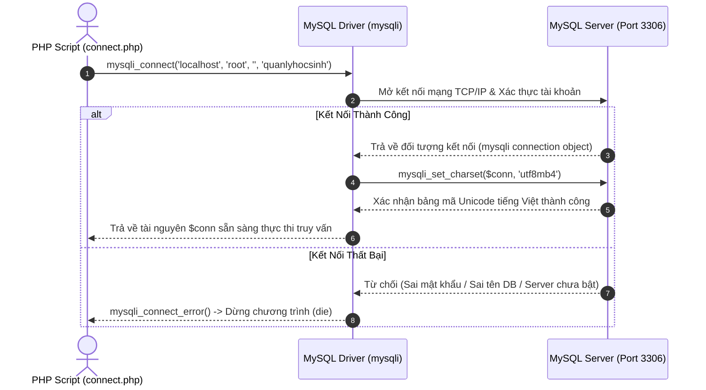

# Kết Nối & Thao Tác Cơ Sở Dữ Liệu MySQL Trong PHP

---

## 1. Bản Chất Hệ Quản Trị CSDL MySQL & Môi Trường XAMPP

### 1.1. Khái Niệm Cơ Bản Về MySQL & MariaDB

**MySQL** là Hệ quản trị cơ sở dữ liệu quan hệ mã nguồn mở (RDBMS - Relational Database Management System) phổ biến nhất thế giới trong phát triển web. Trong bộ công cụ XAMPP hiện đại, hệ CSDL được tích hợp là **MariaDB** — một bản nâng cấp hoàn toàn tương thích 100% với chuẩn MySQL về cả cú pháp SQL, chuẩn giao thức mạng và các hàm kết nối PHP.

Mô hình hoạt động của MySQL dựa trên kiến trúc **Client - Server**:

- **MySQL Server (`mysqld.exe`):** Tiến trình dịch vụ chạy ngầm trên máy chủ, lắng nghe tại cổng mạng mặc định **Port `3306`**, chịu trách nhiệm quản lý cấu trúc bảng, cấp phát bộ nhớ đệm, tối ưu hóa truy vấn và ghi dữ liệu nhị phân xuống ổ cứng.
- **MySQL Client (PHP Engine / phpMyAdmin / CLI):** Ứng dụng gửi các câu lệnh truy vấn SQL qua giao thức TCP/IP tới Server và nhận về tập kết quả dữ liệu.

---

### 1.2. Cấu Trúc Thư Mục Cốt Lõi Của MySQL Trong XAMPP

Toàn bộ hệ thống máy chủ MySQL được cài đặt tại đường dẫn `C:\xampp\mysql\`:

```
C:\xampp\mysql\
│
├── bin/                     # Thư mục chứa các công cụ dòng lệnh thực thi
│   ├── mysqld.exe           # File máy chủ MySQL Daemon (khởi động khi bấm Start trên XAMPP)
│   ├── mysql.exe            # Chương trình Command Line Client để gõ lệnh SQL trực tiếp
│   ├── mysqldump.exe        # Công cụ sao lưu, xuất (Export) cơ sở dữ liệu ra file .sql
│   └── my.ini               # TẬP TIN CẤU HÌNH TRUNG TÂM của MySQL Server
│
├── data/                    # NƠI LƯU TRỮ TOÀN BỘ CƠ SỞ DỮ LIỆU THỰC TẾ TRÊN Ổ CỨNG
│   ├── ibdata1              # Tệp dữ liệu dùng chung của bộ máy lưu trữ InnoDB
│   ├── ib_logfile0          # Tệp nhật ký giao dịch (Transaction Log)
│   ├── mysql/               # CSDL hệ thống lưu thông tin tài khoản người dùng và phân quyền
│   ├── phpmyadmin/          # CSDL lưu cấu hình của ứng dụng web phpMyAdmin
│   └── quanlyhocsinh/       # Thư mục riêng chứa bảng dữ liệu của Database 'quanlyhocsinh'
│
└── backup/                  # Bản sao lưu cấu hình nguyên bản để cứu hộ khi data/ bị lỗi
```

---

### 1.3. Bảng Thông Số Kết Nối Mặc Định Trong XAMPP

| Thông Số Kết Nối           | Giá Trị Mặc Định Trong XAMPP   | Ý Nghĩa Kỹ Thuật                                                                 |
| :------------------------- | :----------------------------- | :------------------------------------------------------------------------------- |
| **Database Host (Server)** | `localhost` hoặc `127.0.0.1`   | Máy chủ cơ sở dữ liệu đang nằm cùng máy tính với Web Server Apache.              |
| **Port**                   | `3306`                         | Cổng mạng tiêu chuẩn của dịch vụ MySQL Server qua giao thức TCP/IP.              |
| **Username**               | `root`                         | Tài khoản quản trị viên tối cao (Superadmin) sở hữu toàn quyền `ALL PRIVILEGES`. |
| **Password**               | `""` _(Chuỗi rỗng / để trống)_ | XAMPP mặc định không cài đặt mật khẩu cho tài khoản `root`.                      |
| **Database Name**          | _(Tên CSDL bạn tự tạo)_        | Ví dụ: `quanlyhocsinh`.                                                          |

---

## 2. Thiết Kế Cơ Sở Dữ Liệu Quan Hệ (RDBMS Foundations)

### 2.1. Các Kiểu Dữ Liệu Cốt Lõi Trong MySQL

Việc lựa chọn đúng kiểu dữ liệu giúp tối ưu dung lượng lưu trữ trên đĩa cứng và tăng tốc độ xử lý câu lệnh truy vấn:

#### A. Nhóm Kiểu Chuỗi Ký Tự (String Types)

- **`CHAR(n)`:** Chuỗi có **độ dài cố định** đúng $n$ ký tự ($0 \le n \le 255$). Nếu chuỗi nạp vào ngắn hơn $n$, MySQL tự động thêm khoảng trắng vào cuối. Dùng cho các trường có độ dài bất biến: Mã sinh viên (`CHAR(8)`), Mã lớp (`CHAR(6)`), Mã quốc gia (`CHAR(2)`), Mã màu Hex (`CHAR(7)`).
- **`VARCHAR(n)`:** Chuỗi có **độ dài biến thiên** tối đa $n$ ký tự ($0 \le n \le 65.535$). Chỉ tiêu tốn đúng số byte thực tế của chuỗi cộng thêm 1-2 byte chỉ độ dài. Thích hợp cho: Họ và tên (`VARCHAR(50)`), Địa chỉ (`VARCHAR(150)`), Tiêu đề bài viết.
- **`TEXT`:** Lưu trữ văn bản dài (tối đa 64 KB), thích hợp cho Nội dung bài viết, Ghi chú, Mô tả chi tiết.

#### B. Nhóm Kiểu Số (Numeric Types)

- **`INT` / `INTEGER`:** Số nguyên 4 byte (phạm vi từ $-2.147.483.648$ đến $2.147.483.647$). Thích hợp cho: Khóa học, Số lượng, Năm sinh, ID tự tăng.
- **`FLOAT` / `DOUBLE`:** Số thực dấu chấm động (số xấp xỉ). Thích hợp cho: Điểm thi (`DIEMTOAN FLOAT`), Tọa độ GPS.
- **`DECIMAL(M, D)`:** Số thập phân có **độ chính xác tuyệt đối** ($M$ là tổng số chữ số, $D$ là số chữ số sau dấu phẩy). Bắt buộc sử dụng cho **Tiền tệ, Giá sản phẩm, Tài chính ngân hàng** (ví dụ `DECIMAL(12, 2)` lưu được đến hàng trăm tỷ đồng mà không bị sai số làm tròn).

#### C. Nhóm Kiểu Ngày Giờ (Date & Time Types)

- **`DATE`:** Lưu trữ Ngày - Tháng - Năm theo định dạng chuẩn quốc tế **`YYYY-MM-DD`** (Ví dụ: `2004-05-12`).
- **`DATETIME`:** Lưu trữ Ngày giờ đầy đủ theo định dạng **`YYYY-MM-DD HH:MM:SS`**.

---

### 2.2. Các Ràng Buộc Toàn Vẹn Dữ Liệu (Constraints)

- **`PRIMARY KEY` (Khóa chính):** Định danh duy nhất cho mỗi bản ghi trong bảng, bắt buộc không được trùng lặp và không được nhận giá trị `NULL`.
- **`FOREIGN KEY` (Khóa ngoại):** Ràng buộc liên kết giữa 2 bảng (Ví dụ: cột `LOP` trong bảng `HOSO` tham chiếu tới cột `MALOP` trong bảng `LOP`). Ngăn chặn việc nhập mã lớp không tồn tại.
- **`NOT NULL`:** Bắt buộc trường này phải có giá trị khi thêm mới bản ghi.
- **`AUTO_INCREMENT`:** Cột số nguyên tự động tăng thêm 1 mỗi khi có bản ghi mới được chèn vào bảng.

---

## 3. Cú Pháp SQL Khởi Tạo & Thao Tác Dữ Liệu (DDL & DML)

### 3.1. DDL: Tạo Cơ Sở Dữ Liệu & Cấu Trúc Bảng Có Khóa Ngoại

```sql
-- 1. Tạo Database với bảng mã tiếng Việt chuẩn UTF-8
CREATE DATABASE IF NOT EXISTS quanlyhocsinh CHARACTER SET utf8mb4 COLLATE utf8mb4_unicode_ci;
USE quanlyhocsinh;

-- 2. Tạo bảng Cha: LOP
CREATE TABLE LOP (
    MALOP CHAR(6) PRIMARY KEY,
    TENLOP VARCHAR(50) NOT NULL,
    KHOAHOC INT,
    GVCN VARCHAR(50)
) ENGINE=InnoDB DEFAULT CHARSET=utf8mb4 COLLATE=utf8mb4_unicode_ci;

-- 3. Tạo bảng Con: HOSO (Có khóa ngoại tham chiếu LOP)
CREATE TABLE HOSO (
    MAHS CHAR(8) PRIMARY KEY,
    HOTEN VARCHAR(50) NOT NULL,
    NGAYSINH DATE,
    DIACHI VARCHAR(150),
    LOP CHAR(6),
    DIEMTOAN FLOAT DEFAULT 0,
    DIEMLY FLOAT DEFAULT 0,
    DIEMHOA FLOAT DEFAULT 0,
    CONSTRAINT fk_hoso_lop FOREIGN KEY (LOP) REFERENCES LOP(MALOP)
    ON UPDATE CASCADE ON DELETE RESTRICT
) ENGINE=InnoDB DEFAULT CHARSET=utf8mb4 COLLATE=utf8mb4_unicode_ci;
```

---

### 3.2. DML: 4 Câu Lệnh Thao Tác Dữ Liệu CRUD

```sql
-- C (Create): Thêm mới bản ghi vào bảng
INSERT INTO LOP (MALOP, TENLOP, KHOAHOC, GVCN)
VALUES ('CNTT1', 'Công nghệ thông tin 1', 15, 'Thầy Nguyễn Văn An');

-- R (Read): Đọc dữ liệu kèm Nối bảng (INNER JOIN)
SELECT H.MAHS, H.HOTEN, H.NGAYSINH, L.TENLOP, H.DIEMTOAN, H.DIEMLY, H.DIEMHOA,
       ROUND((H.DIEMTOAN + H.DIEMLY + H.DIEMHOA) / 3, 2) AS DTB
FROM HOSO H
INNER JOIN LOP L ON H.LOP = L.MALOP
ORDER BY H.HOTEN ASC;

-- U (Update): Cập nhật dữ liệu có điều kiện WHERE
UPDATE LOP
SET TENLOP = 'Công nghệ phần mềm 1', GVCN = 'Cô Trần Thị Bích'
WHERE MALOP = 'CNTT1';

-- D (Delete): Xóa bản ghi có điều kiện WHERE
DELETE FROM HOSO WHERE MAHS = 'HS0001';
```

---

## 4. Chu Trình Kết Nối MySQL Trong PHP Bằng Thư Viện `mysqli`

PHP cung cấp extension **`mysqli` (MySQL Improved)** với hiệu năng cao, bảo mật và hỗ trợ đầy đủ các tính năng hiện đại của MySQL Server.



### Mã Nguồn File Kết Nối Chuẩn (`connect.php`):

```php
<?php
// Thiết lập thông số kết nối
$servername = "localhost";
$username   = "root";
$password   = "";
$dbname     = "quanlyhocsinh";

// 1. Khởi tạo kết nối mạng tới MySQL Server
$conn = mysqli_connect($servername, $username, $password, $dbname);

// 2. Kiểm tra trạng thái kết nối
if (!$conn) {
    die("Lỗi kết nối cơ sở dữ liệu: " . mysqli_connect_error());
}

// 3. Thiết lập bảng mã tiếng Việt UTF-8 chuẩn xác
mysqli_set_charset($conn, "utf8mb4");
?>
```

---

## 5. Cẩm Nang Toàn Bộ Các Hàm `mysqli`

### 5.1. Bảng Tổng Hợp Tra Cứu Nhanh Các Hàm `mysqli`

|  STT   | Tên Hàm                     | Cú Pháp                                   | Công Dụng Chính                                                   | Kiểu Giá Trị Trả Về                                                 |
| :----: | :-------------------------- | :---------------------------------------- | :---------------------------------------------------------------- | :------------------------------------------------------------------ |
| **1**  | `mysqli_query`              | `mysqli_query($conn, $sql)`               | Gửi và thực thi câu lệnh SQL trên MySQL Server                    | `mysqli_result` (với SELECT) hoặc `bool` (với INSERT/UPDATE/DELETE) |
| **2**  | `mysqli_num_rows`           | `mysqli_num_rows($result)`                | Đếm số dòng dữ liệu trả về từ câu lệnh `SELECT`                   | `int` (Số lượng bản ghi)                                            |
| **3**  | `mysqli_fetch_assoc`        | `mysqli_fetch_assoc($result)`             | Lấy 1 bản ghi kế tiếp dưới dạng **Mảng kết hợp** (Key = Tên cột)  | `array` (1 dòng dữ liệu) hoặc `null` (khi hết dữ liệu)              |
| **4**  | `mysqli_fetch_all`          | `mysqli_fetch_all($result, MYSQLI_ASSOC)` | Nạp toàn bộ dữ liệu vào **Mảng 2 chiều** chỉ với 1 dòng lệnh      | `array` (Mảng 2 chiều)                                              |
| **5**  | `mysqli_affected_rows`      | `mysqli_affected_rows($conn)`             | Đếm số dòng thực sự bị tác động bởi `INSERT`, `UPDATE`, `DELETE`  | `int` (Số dòng thay đổi, `0` nếu không đổi, `-1` nếu lỗi)           |
| **6**  | `mysqli_insert_id`          | `mysqli_insert_id($conn)`                 | Lấy giá trị ID tự động tăng (`AUTO_INCREMENT`) vừa chèn           | `int` \| `string` (Mã ID vừa sinh)                                  |
| **7**  | `mysqli_error`              | `mysqli_error($conn)`                     | Lấy thông báo lỗi chi tiết dạng chuỗi từ MySQL Server             | `string` (Mô tả chi tiết lỗi)                                       |
| **8**  | `mysqli_real_escape_string` | `mysqli_real_escape_string($conn, $str)`  | Làm sạch chuỗi, thêm `\` trước ký tự đặc biệt chống SQL Injection | `string` (Chuỗi đã làm sạch an toàn)                                |
| **9**  | `mysqli_free_result`        | `mysqli_free_result($result)`             | Giải phóng bộ nhớ đệm kết quả khỏi RAM của Web Server             | `void`                                                              |
| **10** | `mysqli_close`              | `mysqli_close($conn)`                     | Đóng phiên kết nối mạng TCP/IP tới máy chủ CSDL MySQL             | `bool` (`true` khi đóng thành công)                                 |

---

### 5.2. Phân Tích Chuyên Sâu Từng Hàm Kèm Ví Dụ Thực Tế

#### 5.2.1. Hàm `mysqli_query()`: Cửa Ngõ Thực Thi Mọi Câu Lệnh SQL

- **Cú pháp:** `mysqli_query(mysqli $mysql, string $query): mysqli_result|bool`
- **Bản chất:** Gửi chuỗi SQL thô từ PHP sang MySQL Server biên dịch và thực thi.
- **Giá trị trả về:**
  - Đối với `SELECT`: Trả về con trỏ bộ nhớ đệm **`mysqli_result`** nếu thành công, hoặc `false` nếu cú pháp SQL bị sai.
  - Đối với `INSERT`, `UPDATE`, `DELETE`: Trả về **`true`** nếu thành công, hoặc **`false`** nếu thất bại.

```php
// Ví dụ 1: Thực thi câu lệnh SELECT
$sql = "SELECT * FROM LOP";
$result = mysqli_query($conn, $sql);

if ($result === false) {
    echo "Lỗi cú pháp SQL: " . mysqli_error($conn);
}

// Ví dụ 2: Thực thi câu lệnh INSERT
$sqlInsert = "INSERT INTO LOP (MALOP, TENLOP, KHOAHOC) VALUES ('KT1', 'Kế toán 1', 15)";
if (mysqli_query($conn, $sqlInsert)) {
    echo "Thêm mới lớp thành công!";
} else {
    echo "Lỗi thêm mới: " . mysqli_error($conn);
}
```

---

#### 5.2.2. Hàm `mysqli_num_rows()`: Đếm Số Bản Ghi Trả Về

- **Cú pháp:** `mysqli_num_rows(mysqli_result $result): int`
- **Mục đích:** Đếm số lượng dòng dữ liệu có trong đối tượng `$result` của câu lệnh `SELECT` trước khi tiến hành vẽ bảng.

```php
$sql = "SELECT * FROM HOSO WHERE LOP = 'CNTT1'";
$result = mysqli_query($conn, $sql);

$total = mysqli_num_rows($result);
if ($total > 0) {
    echo "Tìm thấy " . $total . " học sinh trong lớp CNTT1.";
} else {
    echo "Lớp học này hiện chưa có học sinh nào!";
}
```

---

#### 5.2.3. Hàm `mysqli_fetch_assoc()`: Rút Bản Ghi Dưới Dạng Mảng Kết Hợp

- **Cú pháp:** `mysqli_fetch_assoc(mysqli_result $result): ?array`
- **Cơ chế hoạt động:** Hoạt động theo cơ chế **Con trỏ (Cursor)**. Mỗi lần gọi, hàm rút ra **1 dòng bản ghi tiếp theo** dưới dạng Mảng kết hợp (Key = Tên cột trong CSDL: `$row['HOTEN']`, `$row['DIEMTOAN']`). Khi đã duyệt hết dòng cuối cùng, hàm trả về **`null`**, giúp vòng lặp `while` tự động kết thúc.

```php
$sql = "SELECT MAHS, HOTEN, NGAYSINH, DIEMTOAN FROM HOSO";
$result = mysqli_query($conn, $sql);

// Vòng lặp while tiếp tục chạy cho đến khi mysqli_fetch_assoc trả về null
while ($row = mysqli_fetch_assoc($result)) {
    echo "Mã: " . $row['MAHS'] . " | Họ tên: " . $row['HOTEN'] . " | Điểm: " . $row['DIEMTOAN'] . "<br>";
}
```

#### So Sánh Với Các Hàm Fetch Khác:

- **`mysqli_fetch_row($result)`:** Trả về mảng chỉ số số nguyên `[0 => 'HS01', 1 => 'Nguyen Van A']` $\rightarrow$ Khó nhớ thứ tự cột.
- **`mysqli_fetch_array($result)`:** Trả về mảng nhân đôi (vừa có Key chữ vừa có Key số) $\rightarrow$ Tốn gấp đôi bộ nhớ RAM.
- 👉 **Chuẩn mực tối ưu luôn là `mysqli_fetch_assoc()`**.

---

#### 5.2.4. Hàm `mysqli_fetch_all()`: Nạp Toàn Bộ Dữ Liệu Vào Mảng 2 Chiều

- **Cú pháp:** `mysqli_fetch_all(mysqli_result $result, int $mode = MYSQLI_NUM): array`
- **Mục đích:** Thay vì viết vòng lặp `while` thủ công, hàm này nạp toàn bộ kết quả vào một mảng 2 chiều duy nhất chỉ với 1 dòng lệnh.

```php
$sql = "SELECT * FROM LOP";
$result = mysqli_query($conn, $sql);

// Bắt buộc truyền cờ MYSQLI_ASSOC để lấy key là tên cột
$allClasses = mysqli_fetch_all($result, MYSQLI_ASSOC);

echo "Tổng số lớp: " . count($allClasses);
echo "Tên lớp đầu tiên: " . $allClasses[0]['TENLOP'];
```

---

#### 5.2.5. Hàm `mysqli_affected_rows()`: Kiểm Tra Số Dòng Bị Tác Động

- **Cú pháp:** `mysqli_affected_rows(mysqli $mysql): int`
- **Ý nghĩa:** Trả về số lượng dòng thực tế bị thay đổi bởi câu lệnh `INSERT`, `UPDATE` hoặc `DELETE` gần nhất:
  - `> 0`: Đã cập nhật/xóa thành công $N$ bản ghi.
  - `0`: Câu lệnh đúng cú pháp nhưng không có dòng nào khớp với điều kiện `WHERE` (hoặc lệnh `UPDATE` giữ nguyên dữ liệu cũ).
  - `-1`: Câu truy vấn thất bại.

```php
$maHs = 'HS0099';
$sql = "DELETE FROM HOSO WHERE MAHS = '{$maHs}'";
mysqli_query($conn, $sql);

$deletedCount = mysqli_affected_rows($conn);
if ($deletedCount > 0) {
    echo "Đã xóa thành công học sinh " . $maHs;
} else {
    echo "Học sinh " . $maHs . " không tồn tại!";
}
```

---

#### 5.2.6. Hàm `mysqli_insert_id()`: Lấy ID Tự Động Tăng Vừa Sinh

- **Cú pháp:** `mysqli_insert_id(mysqli $mysql): int|string`
- **Ý nghĩa:** Trả về giá trị của cột `AUTO_INCREMENT` vừa được sinh ra trong câu lệnh `INSERT` thành công gần nhất.

```php
$sql = "INSERT INTO TAIKHOAN (username, email) VALUES ('ngocnhat', 'nhat@gmail.com')";
if (mysqli_query($conn, $sql)) {
    $newId = mysqli_insert_id($conn);
    echo "Tạo tài khoản thành công với ID mới là: " . $newId;
}
```

---

#### 5.2.7. Hàm `mysqli_error()`: Bắt Thông Báo Chi Tiết Khi SQL Lỗi

- **Cú pháp:** `mysqli_error(mysqli $mysql): string`
- **Ý nghĩa:** Trả về chuỗi mô tả lỗi chi tiết từ MySQL Server khi `mysqli_query()` trả về `false`.

```php
$sql = "SELECT * FROM BANG_KHONG_TON_TAI";
$result = mysqli_query($conn, $sql);

if (!$result) {
    // In ra: "Table 'quanlyhocsinh.BANG_KHONG_TON_TAI' doesn't exist"
    echo "Lỗi truy vấn: " . mysqli_error($conn);
}
```

---

#### 5.2.8. Hàm `mysqli_real_escape_string()`: Làm Sạch Chuỗi Chống SQL Injection

- **Cú pháp:** `mysqli_real_escape_string(mysqli $mysql, string $string): string`
- **Bản chất:** Thêm ký tự thoát (`\`) vào trước các ký tự điều khiển nguy hiểm như `'`, `"`, `\`, `\0`, `\n` để ngăn kẻ xấu phá vỡ cấu trúc câu lệnh SQL.

```php
$rawInput = "O'Connor";
$safeInput = mysqli_real_escape_string($conn, $rawInput); // Trở thành: O\'Connor

$sql = "SELECT * FROM HOSO WHERE HOTEN = '{$safeInput}'";
$result = mysqli_query($conn, $sql);
```

---

#### 5.2.9. Hàm `mysqli_free_result()` & `mysqli_close()`: Dọn Dẹp Tài Nguyên

```php
// 1. Giải phóng vùng RAM đệm kết quả của PHP
mysqli_free_result($result);

// 2. Đóng Socket kết nối mạng TCP/IP tới MySQL Server
mysqli_close($conn);
```

---

## 6. Thuật Toán Phân Trang Dữ Liệu Bằng Mệnh Đề `LIMIT` (Pagination)

Khi cơ sở dữ liệu có hàng ngàn bản ghi, việc tải toàn bộ ra trang web sẽ làm quá tải RAM và treo trình duyệt. Kỹ thuật **Phân trang** chia dữ liệu thành từng trang nhỏ (ví dụ 10 bản ghi/trang).

```mermaid
sequenceDiagram
    autonumber
    actor Client as Trình Duyệt Web (Client)
    participant PHP as Script PHP (hoso_list.php)
    participant MySQL as MySQL Database

    Client->>PHP: Gửi yêu cầu xem trang 2: GET ?page=2
    PHP->>PHP: Thiết lập cấu hình: $limit = 10; $page = 2
    PHP->>PHP: Tính vị trí bắt đầu: $start = (2 - 1) * 10 = 10
    PHP->>MySQL: 1. Đếm tổng số bản ghi: SELECT COUNT(*) FROM HOSO
    MySQL-->>PHP: Trả về total = 16 bản ghi -> Tính $total_pages = ceil(16 / 10) = 2 trang
    PHP->>MySQL: 2. Lấy dữ liệu trang 2: SELECT * FROM HOSO LIMIT 10, 10
    MySQL-->>PHP: Trả về 6 bản ghi từ vị trí thứ 11 đến 16
    PHP-->>Client: Kết xuất bảng HTML + Thanh phân trang [1] [2]
```

### Công Thức Toán Học Phân Trang Cốt Lõi:

1. **Vị trí bắt đầu lấy dữ liệu trong CSDL (`$start`):**
   $$\text{start} = (\text{page} - 1) \times \text{limit}$$
   - Trang 1 ($page = 1$): $start = (1 - 1) \times 10 = 0 \rightarrow \text{LIMIT } 0, 10$ (Lấy từ bản ghi 1 đến 10).
   - Trang 2 ($page = 2$): $start = (2 - 1) \times 10 = 10 \rightarrow \text{LIMIT } 10, 10$ (Lấy từ bản ghi 11 đến 20).

2. **Tổng số trang hiển thị (`$total_pages`):**
   $$\text{total\_pages} = \left\lceil \frac{\text{Tổng số bản ghi}}{\text{limit}} \right\rceil = \text{ceil}\left(\frac{\text{total\_records}}{\text{limit}}\right)$$

### Mã Nguồn Hoàn Chỉnh Khối Phân Trang:

```php
<?php
require_once __DIR__ . '/connect.php';

// 1. Cấu hình phân trang
$limit = 10; // 10 bản ghi / trang
$page = isset($_GET['page']) ? (int)$_GET['page'] : 1;
if ($page < 1) $page = 1;

$start = ($page - 1) * $limit;

// 2. Đếm tổng số bản ghi trong bảng
$sql_count = "SELECT COUNT(*) AS total FROM HOSO";
$res_count = mysqli_query($conn, $sql_count);
$row_count = mysqli_fetch_assoc($res_count);
$total_records = (int)$row_count['total'];
$total_pages = ceil($total_records / $limit);

// 3. Truy vấn lấy đúng 10 bản ghi của trang hiện tại
$sql = "SELECT * FROM HOSO LIMIT {$start}, {$limit}";
$result = mysqli_query($conn, $sql);
?>

<!-- Bảng hiển thị dữ liệu -->
<table class="custom-table">
    <!-- Render thead & tbody bằng mysqli_fetch_assoc($result) -->
</table>

<!-- Thanh điều hướng phân trang -->
<div class="pagination-container">
    <div class="pagination-info">
        Hiển thị trang <strong><?= $page ?></strong> / <strong><?= $total_pages ?></strong> (Tổng số <?= $total_records ?> học sinh)
    </div>
    <ul class="pagination-list">
        <?php for ($i = 1; $i <= $total_pages; $i++): ?>
            <li class="<?= ($page == $i) ? 'active' : '' ?>">
                <?php if ($page == $i): ?>
                    <span>[<?= $i ?>]</span>
                <?php else: ?>
                    <a href="hoso_list.php?page=<?= $i ?>">[<?= $i ?>]</a>
                <?php endif; ?>
            </li>
        <?php endfor; ?>
    </ul>
</div>
```

---

## 7. Bảo Mật Truy Vấn CSDL & Xử Lý Ngoại Lệ

### 7.1. Phòng Chống Tấn Công SQL Injection

**SQL Injection** xảy ra khi dữ liệu người dùng nhập không được lọc, chèn trực tiếp vào câu lệnh SQL khiến kẻ tấn công có thể thay đổi cấu trúc truy vấn:

_Ví dụ kịch bản tấn công Bypass Login:_

```php
// Dữ liệu người dùng nhập vào ô Username: admin' OR '1'='1
$user = $_POST['username'];
$sql = "SELECT * FROM USER WHERE username = '$user'";
// Câu SQL trở thành: SELECT * FROM USER WHERE username = 'admin' OR '1'='1' -> LUÔN ĐÚNG!
```

#### Hai Giải Pháp Phòng Chống Triệt Để:

1. **Giải pháp 1: Làm sạch dữ liệu bằng `mysqli_real_escape_string()`:**

   ```php
   $safeUser = mysqli_real_escape_string($conn, $_POST['username']);
   $sql = "SELECT * FROM USER WHERE username = '{$safeUser}'";
   ```

2. **Giải pháp 2: Sử dụng Prepared Statements (Tham số hóa truy vấn - Chuẩn tối thượng):**
   ```php
   $stmt = mysqli_prepare($conn, "SELECT * FROM USER WHERE username = ? AND password = ?");
   mysqli_stmt_bind_param($stmt, "ss", $username, $password);
   mysqli_stmt_execute($stmt);
   $result = mysqli_stmt_get_result($stmt);
   ```

---

### 7.2. Phòng Chống Tấn Công XSS Khi Hiển Thị Dữ Liệu

Khi in dữ liệu lấy từ MySQL ra màn hình HTML, luôn luôn bọc qua hàm **`htmlspecialchars()`** để chuyển đổi các ký tự nguy hiểm (`<`, `>`, `"`, `'`, `&`) thành thực thể HTML, ngăn chặn mã JavaScript độc hại thực thi trên trình duyệt:

```php
<!-- Cách viết chuẩn bảo mật tuyệt đối -->
<td><?= htmlspecialchars($row['HOTEN']) ?></td>
<td><?= htmlspecialchars($row['DIACHI']) ?></td>
```

---

### 7.3. Xử Lý Ràng Buộc Khóa Ngoại Khi Xóa Dữ Liệu (Foreign Key Failures)

Khi xóa một Lớp học trong bảng `LOP` mà đang có học sinh trong bảng `HOSO` theo học, MySQL sẽ chặn lại và trả về lỗi ràng buộc khóa ngoại. Cần bắt lỗi này bằng PHP để thông báo thân thiện cho người dùng:

```php
$malop = $_GET['delete_id'];
$sql = "DELETE FROM LOP WHERE MALOP = '{$malop}'";

if (mysqli_query($conn, $sql)) {
    echo "<script>alert('Xóa lớp học thành công!'); window.location.href='lop_list.php';</script>";
} else {
    // Bắt lỗi ràng buộc khóa ngoại MySQL mã lỗi 1451
    if (mysqli_errno($conn) == 1451) {
        echo "<script>alert('Không thể xóa lớp này vì đang có học sinh theo học!'); window.location.href='lop_list.php';</script>";
    } else {
        echo "<script>alert('Lỗi: " . mysqli_error($conn) . "'); window.location.href='lop_list.php';</script>";
    }
}
```

---

## 8. Các Cú Pháp & Tính Năng SQL Hiện Đại (Modern MySQL 5.7+ / 8.0+)

Trong các phiên bản MySQL hiện đại (MySQL 5.7, MySQL 8.0+ và MariaDB 10.2+ tích hợp sẵn trong XAMPP), SQL đã được bổ sung nhiều toán tử và cấu trúc truy vấn mạnh mẽ giúp đơn giản hóa logic xử lý và tối ưu hóa hiệu năng đáng kể.

---

### 8.1. Thao Tác Với Kiểu Dữ Liệu `JSON` & Toán Tử Trích Xuất `->`, `->>`

MySQL hỗ trợ kiểu dữ liệu **`JSON` nguyên bản (Native JSON Data Type)** với khả năng tự động kiểm tra cú pháp hợp lệ và lưu trữ dưới dạng nhị phân tối ưu.

#### A. Hai Toán Tử Trích Xuất Cốt Lõi: `->` và `->>`

| Toán Tử | Tên Gọi Kỹ Thuật | Cú Pháp Rút Gọn | Tương Đương Hàm Gốc | Kết Quả Trả Về |
| :---: | :--- | :--- | :--- | :--- |
| **`->`** | **JSON Extract Operator** | `column->'$.path'` | `JSON_EXTRACT(column, '$.path')` | Trả về chuỗi JSON thô (**còn dấu ngoặc kép `"`** bao quanh chuỗi). |
| **`->>`** | **JSON Unquoting Extract Operator** | `column->>'$.path'` | `JSON_UNQUOTE(JSON_EXTRACT(column, '$.path'))` | Trả về **chuỗi văn bản thuần (đã gỡ bỏ ngoặc kép `"`), số hoặc boolean** sẵn sàng hiển thị. |

#### B. Ví Dụ Bảng Lưu Trữ Cấu Hình Laptop Dạng JSON:

```sql
-- 1. Tạo bảng có cột specs kiểu JSON
CREATE TABLE products_json (
    product_id INT AUTO_INCREMENT PRIMARY KEY,
    product_name VARCHAR(150) NOT NULL,
    price DECIMAL(12, 2) NOT NULL,
    specs JSON NOT NULL -- Cột lưu trữ đối tượng JSON
) ENGINE=InnoDB DEFAULT CHARSET=utf8mb4 COLLATE=utf8mb4_unicode_ci;

-- 2. Chèn dữ liệu JSON vào bảng
INSERT INTO products_json (product_name, price, specs)
VALUES (
    'Dell XPS 13 Plus', 
    34990000, 
    '{
        "cpu": "Intel Core i7-1360P",
        "ram": { "size_gb": 32, "bus_mhz": 6000 },
        "storage": { "type": "SSD", "capacity_gb": 1024 },
        "display": { "size_inch": 13.4, "resolution": "3.5K OLED" },
        "ports": ["Type-C", "Thunderbolt 4"]
    }'
);
```

#### C. Truy Vấn Với Toán Tử `->` và `->>`:

```sql
-- So sánh kết quả của -> và ->>
SELECT 
    product_name,
    specs->'$.cpu'            AS cpu_raw,      -- Kết quả: "Intel Core i7-1360P" (còn ngoặc kép)
    specs->>'$.cpu'           AS cpu_clean,    -- Kết quả: Intel Core i7-1360P (chuỗi sạch)
    specs->>'$.ram.size_gb'   AS ram_gb,       -- Kết quả: 32 (truy cập lồng nhau)
    specs->>'$.ports[0]'      AS first_port    -- Kết quả: Type-C (truy cập phần tử mảng)
FROM products_json;

-- Lọc dữ liệu trong mệnh đề WHERE bằng ->>
SELECT product_name, price, specs->>'$.cpu' AS cpu
FROM products_json
WHERE CAST(specs->>'$.ram.size_gb' AS UNSIGNED) >= 16
  AND specs->>'$.display.resolution' LIKE '%OLED%';
```

#### D. Các Hàm JSON Tiện Ích Hay Dùng Nhất:

```sql
-- 1. JSON_OBJECT & JSON_ARRAY: Gom nhóm dữ liệu thành JSON
SELECT JSON_OBJECT('id', product_id, 'name', product_name, 'price', price) AS json_data 
FROM products_json;

-- 2. JSON_SET: Cập nhật hoặc chèn thêm thuộc tính vào JSON
UPDATE products_json 
SET specs = JSON_SET(specs, '$.ram.size_gb', 64, '$.warranty_months', 24)
WHERE product_id = 1;

-- 3. JSON_CONTAINS: Kiểm tra xem JSON có chứa giá trị nhất định hay không
SELECT * FROM products_json 
WHERE JSON_CONTAINS(specs->'$.ports', '"Thunderbolt 4"');

-- 4. JSON_PRETTY: Định dạng JSON thụt dòng đẹp mắt để hiển thị
SELECT JSON_PRETTY(specs) FROM products_json WHERE product_id = 1;

-- 5. JSON_ARRAYAGG: Gom nhiều dòng thành một mảng JSON
SELECT category_name, JSON_ARRAYAGG(product_name) AS laptop_list
FROM products p
JOIN categories c ON p.category_id = c.category_id
GROUP BY c.category_id, c.category_name;
```

---

### 8.2. Cột Tự Sinh / Cột Ảo (Generated / Virtual Columns)

MySQL cho phép định nghĩa các cột có giá trị được **tính toán tự động** từ các cột khác trong cùng một dòng:

- **`VIRTUAL` (Mặc định):** Không lưu vào ổ đĩa cứng, được tính toán lại mỗi khi câu lệnh `SELECT` đọc đến (tiết kiệm dung lượng đĩa).
- **`STORED`:** Tính toán và ghi cố định xuống ổ cứng mỗi khi bản ghi được `INSERT` hoặc `UPDATE` (chiếm thêm dung lượng nhưng đọc cực nhanh và có thể đánh `INDEX` tăng tốc tìm kiếm).

```sql
-- Ví dụ 1: Tự động tính Điểm trung bình (Được lưu thực tế để truy vấn nhanh)
CREATE TABLE HOSO_MODERN (
    MAHS CHAR(8) PRIMARY KEY,
    HOTEN VARCHAR(50) NOT NULL,
    DIEMTOAN FLOAT DEFAULT 0,
    DIEMLY FLOAT DEFAULT 0,
    DIEMHOA FLOAT DEFAULT 0,
    -- Cột tự động tính Điểm TB, không cần hàm tính thủ công ở PHP
    DTB FLOAT GENERATED ALWAYS AS (ROUND((DIEMTOAN + DIEMLY + DIEMHOA) / 3, 2)) STORED
);

-- Ví dụ 2: Đánh chỉ mục (INDEX) trên trường JSON thông qua Virtual Column
ALTER TABLE products_json 
ADD COLUMN cpu_name VARCHAR(100) GENERATED ALWAYS AS (specs->>'$.cpu') STORED,
ADD INDEX idx_cpu_name (cpu_name);
```

---

### 8.3. Bảng Tạm Biểu Thức Bảng Chung (CTE - Common Table Expressions `WITH`)

Mệnh đề **`WITH` (CTE)** giúp tạo ra các tập kết quả tạm thời ngay trong phạm vi của một truy vấn đơn lẻ, thay thế cho các câu lệnh con lồng nhau (`Subqueries`) phức tạp, giúp mã SQL trở nên trong sáng, dễ bảo trì:

```sql
-- Ví dụ: Lấy danh sách học sinh có điểm trung bình cao hơn điểm trung bình của toàn trường
WITH ThongKeToanTruong AS (
    SELECT AVG(DTB) AS dtb_toan_truong FROM HOSO_MODERN
),
XepLoaiHocSinh AS (
    SELECT MAHS, HOTEN, DTB,
           CASE 
               WHEN DTB >= 8.0 THEN 'Giỏi'
               WHEN DTB >= 6.5 THEN 'Khá'
               ELSE 'Trung Bình'
           END AS danh_hieu
    FROM HOSO_MODERN
)
SELECT hs.MAHS, hs.HOTEN, hs.DTB, hs.danh_hieu, tk.dtb_toan_truong
FROM XepLoaiHocSinh hs
CROSS JOIN ThongKeToanTruong tk
WHERE hs.DTB > tk.dtb_toan_truong
ORDER BY hs.DTB DESC;
```

#### CTE Đệ Quy (`WITH RECURSIVE`) Duyệt Cây Danh Mục / Tổ Chức:

```sql
-- Duyệt cây danh mục đa cấp (Ví dụ: Laptop Gaming -> ASUS -> TUF Series)
WITH RECURSIVE CategoryTree AS (
    -- Điểm bắt đầu (Gốc - Danh mục cha)
    SELECT category_id, category_name, parent_id, 0 AS level
    FROM categories
    WHERE parent_id IS NULL
    
    UNION ALL
    
    -- Đệ quy lấy các danh mục con
    SELECT c.category_id, c.category_name, c.parent_id, ct.level + 1
    FROM categories c
    INNER JOIN CategoryTree ct ON c.parent_id = ct.category_id
)
SELECT * FROM CategoryTree ORDER BY level, category_id;
```

---

### 8.4. Hàm Cửa Sổ (Window Functions - Mệnh Đề `OVER (PARTITION BY ... ORDER BY ...)`)

Window Functions cho phép thực hiện tính toán trên một tập hợp các dòng dữ liệu liên quan mà **không làm gộp dòng lại như `GROUP BY`**.

```sql
-- 1. ROW_NUMBER(), DENSE_RANK(): Xếp hạng học sinh theo từng lớp học
SELECT 
    MAHS, 
    HOTEN, 
    LOP, 
    DTB,
    -- Đánh số thứ tự trong từng lớp
    ROW_NUMBER() OVER (PARTITION BY LOP ORDER BY DTB DESC) AS stt_trong_lop,
    -- Xếp hạng theo điểm (đồng điểm cùng hạng)
    DENSE_RANK() OVER (PARTITION BY LOP ORDER BY DTB DESC) AS hang_trong_lop
FROM HOSO_MODERN;

-- 2. Lấy Top 2 sản phẩm Laptop có giá cao nhất của TỪNG HÃNG
WITH RankedProducts AS (
    SELECT 
        product_id, 
        product_name, 
        category_id, 
        price,
        ROW_NUMBER() OVER (PARTITION BY category_id ORDER BY price DESC) as top_rank
    FROM products
)
SELECT * FROM RankedProducts WHERE top_rank <= 2;

-- 3. LAG() và LEAD(): So sánh giá sản phẩm hiện tại với sản phẩm trước/sau nó
SELECT 
    product_name, 
    price,
    LAG(price, 1) OVER (ORDER BY price ASC) AS gia_may_re_hon_lien_ke,
    LEAD(price, 1) OVER (ORDER BY price ASC) AS gia_may_dat_hon_lien_ke
FROM products;
```

---

### 8.5. Các Hàm Tính Toán & Thao Tác Dữ Liệu Tiện Ích Hiện Đại

#### A. Hàm `GREATEST()` & `LEAST()` (So Sánh Giá Trị Lớn Nhất / Nhỏ Nhất)

- **`GREATEST(v1, v2, ...)`:** Trả về giá trị lớn nhất trong danh sách đối số.
  - *Ứng dụng kinh điển (Bài 15 - Quản lý kho):* Trừ số lượng tồn kho khi mua hàng nhưng **đảm bảo không bao giờ bị âm dưới `0`**:
    ```sql
    UPDATE products 
    SET quantity = GREATEST(0, quantity - 2) 
    WHERE product_id = 10;
    ```
- **`LEAST(v1, v2, ...)`:** Trả về giá trị nhỏ nhất trong danh sách (Dùng để giới hạn số lượng tối đa được phép mua: `LEAST(max_limit, user_input)`).

#### B. Hàm Xử Lý Giá Trị Rỗng `COALESCE()` & `IFNULL()`

```sql
-- COALESCE: Lấy giá trị đầu tiên khác NULL trong danh sách đối số
-- Nếu old_price NULL -> lấy price -> nếu price NULL -> lấy 0
SELECT product_name, COALESCE(old_price, price, 0) AS display_price FROM products;

-- IFNULL: Viết tắt cho 2 đối số
SELECT product_name, IFNULL(summary_spec, 'Chưa có thông số') AS spec FROM products;
```

#### C. Thao Tác "Thêm Mới Hoặc Cập Nhật" (UPSERT Hiện Đại)

```sql
-- Cú pháp hiện đại (MySQL 8.0.19+): Dùng bí danh hàng mới 'AS new_row'
INSERT INTO product_views (product_id, view_count, last_viewed)
VALUES (101, 1, NOW())
AS new_data
ON DUPLICATE KEY UPDATE 
    view_count = product_views.view_count + 1,
    last_viewed = new_data.last_viewed;
```

#### D. Biểu Thức Điều Kiện Phân Nhánh `CASE WHEN`

```sql
SELECT product_name, price, quantity,
       CASE 
           WHEN quantity = 0 THEN '🚫 Hết hàng'
           WHEN quantity <= 5 THEN '⚠️ Sắp hết hàng'
           ELSE '✅ Còn hàng'
       END AS stock_status
FROM products;
```
